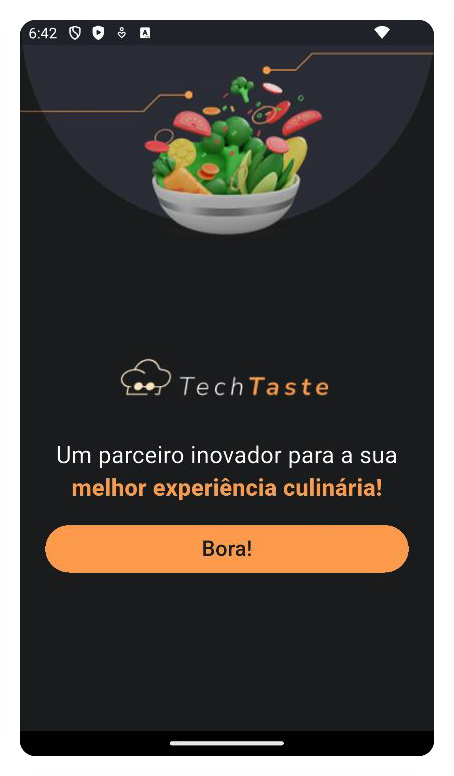
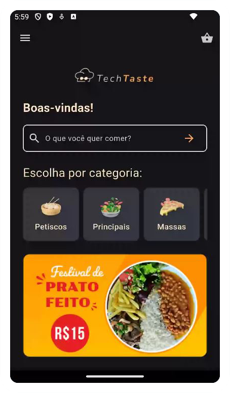
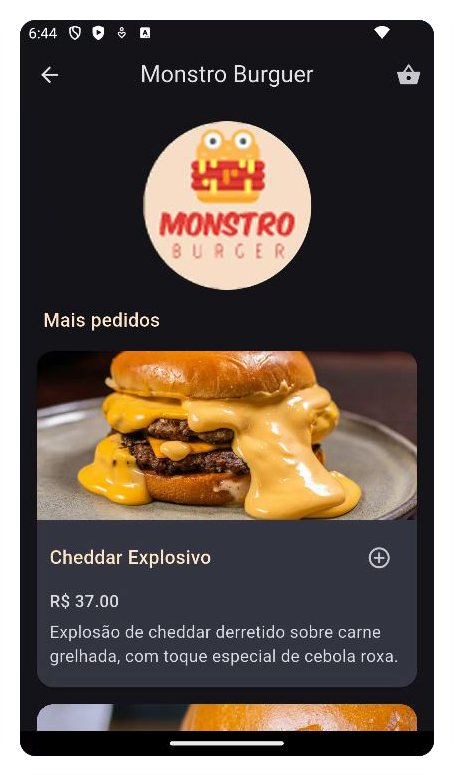

# 🍽️ TechTaste – Food Delivery App (Versão 2.0)

**TechTaste v2** é a continuação e expansão do app desenvolvido na **Imersão Mobile da Alura (abril - 2025)**. Esta nova versão traz funcionalidades avançadas, refatorações no código e aprimoramentos de UI/UX que simulam com mais fidelidade o fluxo de um app real de delivery.

 

O projeto original serviu como base, e ao longo de maio novas funcionalidades foram adicionadas para transformar o TechTaste em um aplicativo ainda mais completo e interativo.

> 📦 Repositório original: [TechTaste-imersaomobile-alura](https://github.com/daniamorimdesa/TechTaste-imersaomobile-alura)
> 
> 🎨 Design original: [Projeto TechTaste no Figma](https://www.figma.com/design/5WKjBnTvAKTraWTRqsjK02/TechTaste-%7C-Imers%C3%A3o?node-id=7-47)

---

## 📱🥗 Avanços da Versão 2.0

### ✅ Reestruturação do Projeto
- Modularização da estrutura de arquivos e pastas (`models`, `providers`, `screens`, `widgets`)
- Navegação por rotas nomeadas (`Navigator.pushReplacementNamed`, `ModalRoute.of`)
- Refatoração da `main.dart` com controle centralizado das rotas

---

### ✅ Novas Funcionalidades Implementadas
- Tela de seleção de endereço (com validação de campos)
- Escolha de forma de pagamento (cartão, pix ou dinheiro)
- Campo de troco em caso de pagamento em dinheiro, com verificação de valor
- Resumo final do pedido antes de concluir
- Separação do estado do app com múltiplos `Providers` (`BagProvider`, `UserDataProvider`)
- Tela final de confirmação do pedido com botão de "Voltar para o início" que redireciona corretamente para a Home
- Melhorias visuais e responsividade nas telas
- Uso de `const`, melhorias de performance e legibilidade de código

---

### ✨ Extras
- Suporte completo à navegação entre todas as telas do app
- Feedback visual ao usuário sobre seus pedidos
- Melhorias nos assets, incluindo imagens dos pratos e descrições únicas para cada um deles

---

## 📷 Capturas de Tela

| Splash Screen | Home Screen | Restaurant Screen |
|--------------|---------------------|------------------|
|  |  |  |

---

## 📝 Conceitos estudados com essa refatoração:

- Como organizar um projeto Flutter em múltiplas camadas (dados, modelo, lógica e interface)
- Aplicação prática do `Provider` com múltiplos estados coexistindo
- Gerenciamento de fluxo de navegação e pilha com rotas nomeadas
- Validação de dados de formulário (campos obrigatórios, números válidos)
- Criação de experiência de usuário mais realista com feedbacks visuais
- Importância da modularização para facilitar manutenção e expansão do app

---

## 🛠️ Tecnologias Utilizadas

- **Flutter** com **Dart**
- **Provider** para gerenciamento de estado
- **Firebase Studio** como ambiente de desenvolvimento
- **Figma** como base visual
- **GitHub** para versionamento

---

## ▶️ Como executar o projeto localmente

```bash
# Clone o repositório
git clone https://github.com/daniamorimdesa/TechTaste-foodapp-v2.git

# Acesse o diretório
cd TechTaste-foodapp-v2

# Instale as dependências
flutter pub get

# Execute o app
flutter run

```
---

## 📚 Documentação Completa
A documentação detalhada do projeto está disponível [aqui](https://github.com/daniamorimdesa/TechTaste-foodapp-v2/main/docs).

---

## 📄 Licença
This project is licensed under the MIT License. See the LICENSE file for details.

---

##   Autora
```
Daniela Amorim de Sá
Engenheira Eletrônica | Sistemas Embarcados & IoT  
Projeto desenvolvido como parte da Imersão Mobile da Alura (abril - 2025).
```
