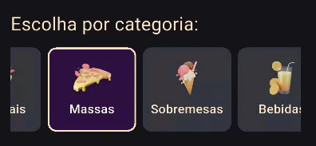
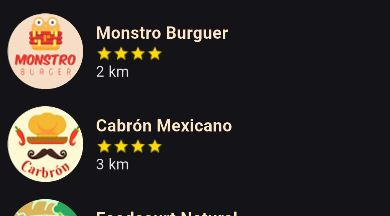

# Pasta `home/widgets/`

Esta pasta contém widgets reutilizáveis que compõem visualmente a tela inicial do app. Eles são responsáveis por representar elementos interativos, como categorias, restaurantes e filtros, com foco na experiência do usuário.

---

## `category_widget.dart`
 

### Funcionalidade

Este widget representa visualmente uma **categoria de pratos** (ex: "Petiscos", "Principais", "Massas") na interface da tela inicial, permitindo ao usuário **selecionar uma categoria** para filtrar os restaurantes exibidos. O widget mostra um ícone associado à categoria e altera sua aparência quando está selecionado.

### Decisão técnica

- Utiliza `AnimatedContainer` para suavizar transições visuais ao alternar a seleção
- Emprega `InkWell` para garantir responsividade ao toque, com splash animado
- As imagens das categorias são carregadas dinamicamente a partir do diretório `assets/categories/`, com base no nome da categoria em letras minúsculas
- Um `Tooltip` é usado para exibir o nome completo da categoria, melhorando a acessibilidade
- A aparência (cores, borda, texto) é alterada dinamicamente de acordo com o estado `isSelected`


### Código comentado

```dart
// Widget reutilizável para exibir uma categoria de prato na tela inicial
class CategoryWidget extends StatelessWidget {
  final String category;      // Nome da categoria (ex: "Massas")
  final bool isSelected;      // Define se esta categoria está selecionada
  final VoidCallback onTap;   // Função a ser chamada ao tocar no widget

  const CategoryWidget({
    super.key,
    required this.category,
    required this.isSelected,
    required this.onTap,
  });

  @override
  Widget build(BuildContext context) {
    return Material(
      color: Colors.transparent, // Permite efeito visual do InkWell
      child: InkWell(
        borderRadius: BorderRadius.circular(10.0),
        onTap: onTap,
        splashColor: AppColors.mainColor.withOpacity(0.3),
        child: AnimatedContainer(
          duration: const Duration(milliseconds: 300),
          curve: Curves.easeInOut,
          width: 105,
          height: 100,
          padding: const EdgeInsets.symmetric(horizontal: 6.0),
          decoration: BoxDecoration(
            color: isSelected
                ? const Color.fromARGB(255, 107, 11, 162).withOpacity(0.3)
                : AppColors.lightBackgroundColor,
            borderRadius: BorderRadius.circular(10.0),
            border: Border.all(
              color: isSelected
                  ? AppColors.highlightTextColor
                  : AppColors.lightBackgroundColor,
              width: 2,
            ),
          ),
          child: Column(
            mainAxisAlignment: MainAxisAlignment.center,
            children: [
              // Ícone da categoria (imagem)
              Image.asset(
                'assets/categories/${category.toLowerCase()}.png',
                height: 40,
              ),
              const SizedBox(height: 6),
              // Nome da categoria com tooltip para acessibilidade
              Tooltip(
                message: category,
                child: Text(
                  category,
                  style: TextStyle(
                    fontSize: 15.0,
                    fontWeight: FontWeight.w500,
                    color: isSelected
                        ? Colors.white
                        : AppColors.highlightTextColor,
                  ),
                  textAlign: TextAlign.center,
                  maxLines: 2,
                  overflow: TextOverflow.ellipsis,
                ),
              ),
            ],
          ),
        ),
      ),
    );
  }
}
```

---
## `restaurant_widget.dart`
 

### Funcionalidade

Este widget exibe um card compacto com as informações principais de um restaurante:
- Imagem do restaurante;
- Nome;
- Avaliação (estrelas);
- Distância em quilômetros

Ao ser clicado, ele realiza a navegação para a tela de detalhes daquele restaurante.

### Decisão técnica

- Usa um `InkWell` para garantir feedback visual ao toque e permitir navegação
- A quantidade de estrelas é renderizada dinamicamente a partir do campo `restaurant.stars`
- Os dados do restaurante são encapsulados em uma instância da classe `Restaurant`, garantindo consistência com o modelo de dados
- Navega para a `RestaurantScreen` passando o objeto `restaurant` via `MaterialPageRoute`

### Código comentado

```dart
class RestaurantWidget extends StatelessWidget {
  final Restaurant restaurant;

  const RestaurantWidget({super.key, required this.restaurant});

  @override
  Widget build(BuildContext context) {
    return InkWell(
      // Ao tocar no widget, abre a tela do restaurante
      onTap: () {
        Navigator.push(
          context,
          MaterialPageRoute(
            builder: (context) {
              return RestaurantScreen(restaurant: restaurant);
            },
          ),
        );
      },
      child: Row(
        spacing: 12.0, // espaçamento entre imagem e texto
        children: [
          // Imagem do restaurante
          Image.asset('assets/${restaurant.imagePath}', width: 72),

          // Informações do restaurante
          Column(
            crossAxisAlignment: CrossAxisAlignment.start,
            children: [
              // Nome
              Text(
                restaurant.name,
                style: TextStyle(
                  color: AppColors.highlightTextColor,
                  fontWeight: FontWeight.bold,
                  fontSize: 16.0,
                ),
              ),
              // Avaliação com estrelas
              Row(
                children: List.generate(restaurant.stars.toInt(), (index) {
                  return Image.asset('assets/others/star.png', width: 16.0);
                }),
              ),
              // Distância
              Text("${restaurant.distance} km"),
            ],
          ),
        ],
      ),
    );
  }
}
```
---
## `search_bar_widget.dart`

### Funcionalidade

Este widget exibe uma barra de busca responsiva, permitindo ao usuário digitar e enviar uma consulta textual. Ao submeter a busca, o aplicativo navega para a `SearchResultsScreen`, passando o texto da busca (`query`).

### Decisão técnica

- A barra de busca foi implementada como um `StatefulWidget` para controlar o foco do campo de texto e o valor digitado
- A borda da barra muda de cor dinamicamente quando está em foco
- A busca é acionada tanto ao pressionar o botão de enviar quanto ao tocar no ícone de seta
- Após a busca, o campo é limpo e perde o foco, melhorando a experiência de uso

### Código comentado

```dart
class SearchBarWidget extends StatefulWidget {
  const SearchBarWidget({super.key});

  @override
  State<SearchBarWidget> createState() => _SearchBarWidgetState();
}

class _SearchBarWidgetState extends State<SearchBarWidget> {
  final FocusNode _focusNode = FocusNode();
  final TextEditingController _controller = TextEditingController();
  bool _hasFocus = false;

  @override
  void initState() {
    super.initState();

    // Observa o foco do campo para atualizar a UI
    _focusNode.addListener(() {
      setState(() {
        _hasFocus = _focusNode.hasFocus;
      });
    });
  }

  @override
  void dispose() {
    _focusNode.dispose();
    _controller.dispose();
    super.dispose();
  }

  void _handleSearch() {
    final query = _controller.text.trim();
    if (query.isEmpty) return;

    // Navega para a tela de resultados da busca
    Navigator.push(
      context,
      MaterialPageRoute(
        builder: (context) => SearchResultsScreen(query: query),
      ),
    );

    // Desfoca e limpa o campo de busca
    _focusNode.unfocus();
    _controller.clear();
  }

  @override
  Widget build(BuildContext context) {
    final Color activeColor = AppColors.mainColor;
    final Color inactiveColor = AppColors.cardTextColor;

    return AnimatedContainer(
      duration: const Duration(milliseconds: 300),
      decoration: BoxDecoration(
        color: Colors.transparent,
        borderRadius: BorderRadius.circular(8),
        border: Border.all(
          color: _hasFocus ? activeColor : inactiveColor,
          width: 1.5,
        ),
      ),
      padding: const EdgeInsets.symmetric(horizontal: 8),
      child: Row(
        children: [
          const Icon(Icons.search, color: AppColors.cardTextColor),
          const SizedBox(width: 8),
          Expanded(
            child: TextField(
              controller: _controller,
              focusNode: _focusNode,
              onSubmitted: (_) => _handleSearch(),
              style: TextStyle(
                color: _hasFocus ? activeColor : inactiveColor,
                fontSize: 16,
              ),
              cursorColor: activeColor,
              decoration: InputDecoration(
                hintText: 'O que você quer comer?',
                hintStyle: TextStyle(
                  color: _hasFocus ? activeColor : inactiveColor,
                  fontSize: 14,
                ),
                border: InputBorder.none,
              ),
            ),
          ),
          IconButton(
            icon: Icon(Icons.arrow_forward, color: activeColor),
            onPressed: _handleSearch,
            tooltip: 'Buscar',
          ),
        ],
      ),
    );
  }
}
```
---
## `home_drawer.dart`

### Funcionalidade
O widget `HomeDrawer` é o menu lateral da aplicação, permitindo navegação para duas seções principais:
- Sacola: abre a tela de `checkout` caso haja um restaurante selecionado
- Minha conta: navega para a tela de gerenciamento de conta do usuário

É exibido dentro de um `Drawer`, com padding e estilo personalizados.

### Decisão técnica

- O componente utiliza o `BagProvider` (via Provider) para acessar o restaurante selecionado
- Navegação feita com `Navigator.push` para transição entre telas
- Utiliza o widget customizado `HomeDrawerButton` para manter consistência visual e comportamento de toque
- Um `SnackBar` informa o usuário caso a sacola esteja vazia, evitando navegação sem propósito

### Código comentado

```dart
class HomeDrawer extends StatelessWidget {
  const HomeDrawer({super.key});

  @override
  Widget build(BuildContext context) {
    return Drawer(
      backgroundColor: AppColors.backgroundCardTextColor, // Cor de fundo do Drawer
      child: SafeArea(
        child: Padding(
          padding: const EdgeInsets.symmetric(horizontal: 16, vertical: 24),
          child: Column(
            crossAxisAlignment: CrossAxisAlignment.start,
            children: [
              // Botão de título "Menu" — apenas visual, sem ação
              HomeDrawerButton(
                text: 'Menu',
                onPressed: null,
                normalColor: AppColors.backgroundCardTextColor,
                pressedColor: AppColors.backgroundCardTextColor,
                textColor: AppColors.buttonsColor,
                pressedTextColor: AppColors.cardTextColor,
                fontSize: 20,
                fontWeight: FontWeight.w600,
              ),
              const SizedBox(height: 20),

              // Botão "Sacola" — verifica se há restaurante selecionado
              HomeDrawerButton(
                text: 'Sacola',
                onPressed: () {
                  final restaurant = context.read<BagProvider>().selectedRestaurant;

                  if (restaurant != null) {
                    Navigator.of(context).pop(); // Fecha o Drawer
                    Navigator.of(context).push(
                      MaterialPageRoute(
                        builder: (context) => CheckoutScreen(restaurant: restaurant),
                      ),
                    );
                  } else {
                    // Alerta se a sacola estiver vazia
                    ScaffoldMessenger.of(context).showSnackBar(
                      const SnackBar(content: Text('Sua sacola está vazia')),
                    );
                  }
                },
                normalColor: AppColors.backgroundCardTextColor,
                pressedColor: AppColors.buttonsColor,
                textColor: AppColors.cardTextColor,
                pressedTextColor: AppColors.backgroundColor,
                fontSize: 20,
                fontWeight: FontWeight.w400,
              ),
              const SizedBox(height: 20),

              // Botão "Minha conta" — abre tela de conta
              HomeDrawerButton(
                text: 'Minha conta',
                onPressed: () {
                  Navigator.pop(context); // Fecha o Drawer
                  Navigator.push(
                    context,
                    MaterialPageRoute(builder: (_) => const AccountScreen()),
                  );
                },
                normalColor: AppColors.backgroundCardTextColor,
                pressedColor: AppColors.buttonsColor,
                textColor: AppColors.cardTextColor,
                pressedTextColor: AppColors.backgroundColor,
                fontSize: 20,
                fontWeight: FontWeight.w400,
              ),
            ],
          ),
        ),
      ),
    );
  }
}

```
---
## `home_drawer_button.dart`

### Funcionalidade
O `HomeDrawerButton` é um botão reutilizável e customizado para uso no `Drawer` da tela inicial. Ele altera seu visual dinamicamente conforme o estado (pressionado ou não), oferecendo feedback visual ao toque.


### Decisão técnica

- Utiliza `GestureDetector` para detectar os eventos de `tapDown`, `tapUp` e `tapCancel`, ativando o estado `_isPressed`
- A cor do botão e do texto muda quando pressionado, melhorando a experiência tátil
- Permite total personalização via parâmetros:cores (normal e pressionado) e estilo do texto (cor, tamanho, peso, alinhamento)
- O botão pode ser desabilitado (`onPressed: null`), útil para ações apenas visuais (ex: título).


### Código comentado

```dart
class HomeDrawerButton extends StatefulWidget {
  final String text;
  final VoidCallback? onPressed;
  final Color normalColor;
  final Color pressedColor;
  final Color textColor;
  final Color pressedTextColor;
  final double fontSize;
  final FontWeight fontWeight;
  final TextAlign textAlign;

  const HomeDrawerButton({
    super.key,
    required this.text,
    required this.onPressed,
    required this.normalColor,
    required this.pressedColor,
    required this.textColor,
    required this.pressedTextColor,
    required this.fontSize,
    required this.fontWeight,
    this.textAlign = TextAlign.left,
  });

  @override
  State<HomeDrawerButton> createState() => _HomeDrawerButtonState();
}

class _HomeDrawerButtonState extends State<HomeDrawerButton> {
  bool _isPressed = false; // Estado local de pressionamento

  // Evento: botão foi pressionado
  void _handleTapDown(TapDownDetails details) {
    setState(() {
      _isPressed = true;
    });
  }

  // Evento: botão foi solto
  void _handleTapUp(TapUpDetails details) {
    setState(() {
      _isPressed = false;
    });
  }

  // Evento: toque foi cancelado (ex: dedo deslizou para fora)
  void _handleTapCancel() {
    setState(() {
      _isPressed = false;
    });
  }

  @override
  Widget build(BuildContext context) {
    return GestureDetector(
      onTap: widget.onPressed,
      onTapDown: widget.onPressed != null ? _handleTapDown : null,
      onTapUp: widget.onPressed != null ? _handleTapUp : null,
      onTapCancel: widget.onPressed != null ? _handleTapCancel : null,
      child: Container(
        width: double.infinity,
        padding: const EdgeInsets.symmetric(vertical: 12, horizontal: 16),
        decoration: BoxDecoration(
          color: _isPressed && widget.onPressed != null
              ? widget.pressedColor
              : widget.normalColor,
          borderRadius: BorderRadius.circular(32), // Borda arredondada
        ),
        child: Text(
          widget.text,
          textAlign: widget.textAlign,
          style: TextStyle(
            color: _isPressed && widget.onPressed != null
                ? widget.pressedTextColor
                : widget.textColor,
            fontSize: widget.fontSize,
            fontWeight: widget.fontWeight,
          ),
        ),
      ),
    );
  }
}
