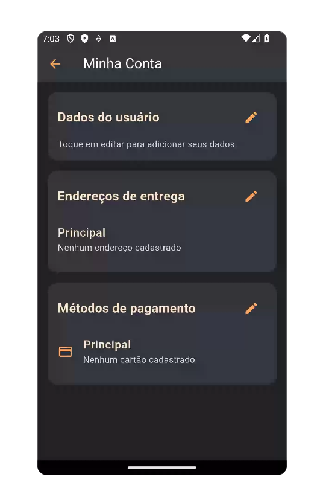
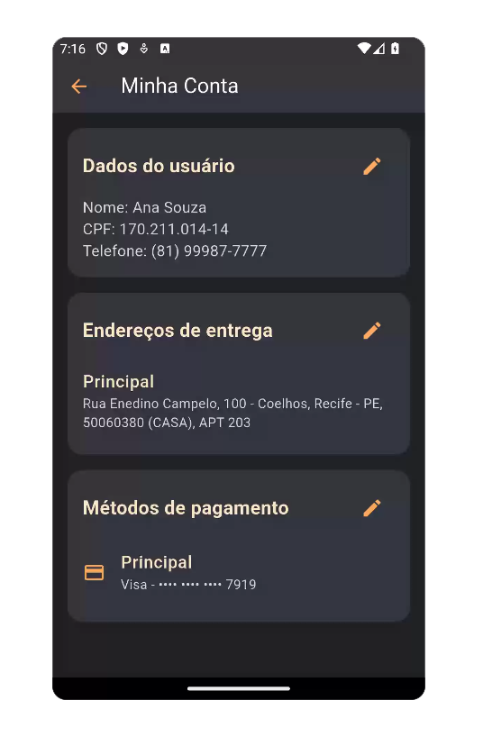

# Pasta `account/`

| Account Screen | Account Screen Mockup | 
|-------------|------------------------|
|  |  |

## Funcionalidade

A pasta `ui/account` contém todas as telas e componentes relacionados à conta do usuário. Isso inclui:

- A tela principal da conta (`account_screen.dart`)
- Listagem e edição de endereços e cartões de crédito
- Atualização dos dados pessoais
- Componentes reutilizáveis para navegação entre seções

O objetivo principal é proporcionar ao usuário um acesso rápido e organizado às informações sensíveis da sua conta, com foco em usabilidade e segurança.

---

## Decisão Técnica

- Utilização de `Navigator.pushNamed()` para navegação entre telas
- Organização das telas por responsabilidade única: edição de dados, endereços e cartões possuem suas próprias screens
- Criação do widget `UserSectionCard` para reutilização dos blocos de acesso às seções da conta
- Uso de `Form` e `TextFormField` com validação local nos formulários de edição
- Todas as telas são compatíveis com a arquitetura atual do projeto, podendo ser integradas facilmente com os `providers` de autenticação e dados

---

## Estrutura de Arquivos

| Arquivo                          | Descrição                                                                 |
|----------------------------------|---------------------------------------------------------------------------|
| `account_screen.dart`            | Tela principal da conta com atalhos para dados, endereços e cartões       |
| `address_list_screen.dart`       | Lista os endereços cadastrados com opção de editar e adicionar            |
| `credit_card_form_screen.dart`   | Tela para cadastrar ou editar cartões de crédito                          |
| `credit_card_list_screen.dart`   | Lista de cartões cadastrados com botões de ação                           |
| `edit_address_screen.dart`       | Formulário de edição de endereço com validações básicas                   |
| `edit_user_data_screen.dart`     | Permite edição dos dados pessoais do usuário                              |
| `widgets/user_section_card.dart` | Componente visual de atalho reutilizável entre seções                     |

---
## Observações Finais
- A modularização favorece testes unitários e manutenção futura
- Os componentes podem ser facilmente reaproveitados em futuras funcionalidades como "preferências do usuário" ou "segurança da conta"
- Todas as telas estão prontas para integração com o backend de autenticação e banco de dados do Firebase

---

## `account_screen.dart`

### Funcionalidade
A `AccountScreen` é a principal tela dedicada às configurações e dados do usuário. Ela exibe seções como dados pessoais, endereços de entrega e métodos de pagamento, permitindo ao usuário visualizar e editar suas informações por meio de cartões visuais (`UserSectionCard`).
A tela promove uma navegação intuitiva, acessando outras telas especializadas (`EditUserDataScreen`, `AddressListScreen`, `CreditCardListScreen`) conforme a interação do usuário.

---
### Decisão Técnica
- Uso de `StatelessWidget`: Como a tela apenas consome dados via `Provider` e não possui estado interno, a escolha por `StatelessWidget` promove simplicidade
- Gerenciamento de estado com `Provider`: Os dados do usuário são recuperados dinamicamente através do `UserDataProvider`, permitindo que a interface se mantenha reativa a mudanças globais
- Reutilização de componentes: O `UserSectionCard` é utilizado para estruturar visualmente cada seção de forma padronizada e modular
- Navegação via `MaterialPageRoute`: Para manter uma transição clara entre as seções e telas de edição específicas
- Design consistente: Estilo visual seguindo os padrões definidos nos arquivos `AppColors` e `AppTextStyles`, garantindo coerência com o restante da aplicação.
  
---
### Código comentado
```dart
// Tela principal da conta com atalhos para dados, endereços e cartões
class AccountScreen extends StatelessWidget {
  const AccountScreen({super.key});

  @override
  Widget build(BuildContext context) {
    // Acessa os dados do usuário por meio do Provider
    final userData = Provider.of<UserDataProvider>(context);

    return Scaffold(
      backgroundColor: AppColors.backgroundColor,
      
      // AppBar da tela com título e estilo customizado
      appBar: AppBar(
        backgroundColor: AppColors.lightBackgroundColor,
        title: const Text('Minha Conta', style: AppTextStyles.titleLargeWhite),
        iconTheme: const IconThemeData(color: AppColors.mainColor),
      ),

      // Corpo principal com rolagem vertical
      body: ListView(
        padding: const EdgeInsets.all(16.0),
        children: [
          // Seção: Dados do usuário
          UserSectionCard(
            title: 'Dados do usuário',
            child: Column(
              crossAxisAlignment: CrossAxisAlignment.start,
              children: [
                if (userData.fullName.isNotEmpty)
                  Column(
                    crossAxisAlignment: CrossAxisAlignment.start,
                    children: [
                      // Exibe nome, CPF e telefone, se disponíveis
                      Text('Nome: ${userData.fullName}', style: AppTextStyles.body),
                      Text('CPF: ${userData.cpf}', style: AppTextStyles.body),
                      Text('Telefone: ${userData.phone}', style: AppTextStyles.body),
                    ],
                  )
                else
                  // Mensagem padrão quando não há dados cadastrados
                  const Text(
                    'Toque em editar para adicionar seus dados.',
                    style: AppTextStyles.caption,
                  ),
              ],
            ),
            onEdit: () {
              // Navega para a tela de edição de dados pessoais
              Navigator.push(
                context,
                MaterialPageRoute(builder: (context) => const EditUserDataScreen()),
              );
            },
          ),

          const SizedBox(height: 16),

          // Seção: Endereços de entrega
          UserSectionCard(
            title: 'Endereços de entrega',
            child: Column(
              children: [
                ListTile(
                  contentPadding: EdgeInsets.zero,
                  title: const Text('Principal', style: AppTextStyles.dishTitle),
                  subtitle: Text(
                    userData.addresses.any((a) => a.isPrimary)
                      ? userData.addresses.firstWhere((a) => a.isPrimary).fullAddress
                      : 'Nenhum endereço cadastrado',
                    style: AppTextStyles.caption,
                  ),
                ),
              ],
            ),
            onEdit: () {
              // Navega para a tela de gerenciamento de endereços
              Navigator.push(
                context,
                MaterialPageRoute(builder: (context) => const AddressListScreen()),
              );
            },
          ),

          const SizedBox(height: 16),

          // Seção: Métodos de pagamento
          UserSectionCard(
            title: 'Métodos de pagamento',
            child: Column(
              children: [
                ListTile(
                  contentPadding: EdgeInsets.zero,
                  leading: const Icon(Icons.credit_card, color: AppColors.mainColor),
                  title: const Text('Principal', style: AppTextStyles.dishTitle),
                  subtitle: Text(
                    userData.creditCards.any((a) => a.isPrimary)
                      ? '${userData.creditCards.firstWhere((a) => a.isPrimary).brand} - '
                        '${userData.creditCards.firstWhere((a) => a.isPrimary).maskedNumber}'
                      : 'Nenhum cartão cadastrado',
                    style: AppTextStyles.caption,
                  ),
                ),
              ],
            ),
            onEdit: () {
              // Navega para a tela de cartões de crédito
              Navigator.push(
                context,
                MaterialPageRoute(builder: (context) => const CreditCardListScreen()),
              );
            },
          ),
        ],
      ),
    );
  }
}
