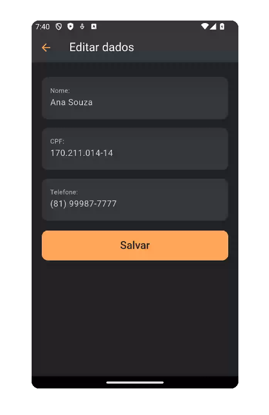

# Pasta `account/`

| Account Screen | Edit User Data | Account Screen Mockup | 
|----------------|------------------------|------------------------|
|  |  | |

> ⚠️ **Observação**:  
> Os dados exibidos nas capturas de tela foram gerados automaticamente para fins de simulação, utilizando a ferramenta gratuita [4Devs - Gerador de Pessoas](https://www.4devs.com.br/computacao).  
> Nenhuma informação real de usuário foi utilizada.

---

## Funcionalidade

A pasta `ui/account` contém todas as telas e componentes relacionados à conta do usuário. Isso inclui:

- A tela principal da conta (`account_screen.dart`)
- Listagem e edição de endereços e cartões de crédito
- Atualização dos dados pessoais
- Componentes reutilizáveis para navegação entre seções

O objetivo principal é proporcionar ao usuário um acesso rápido e organizado às informações sensíveis da sua conta, com foco em usabilidade e segurança.

---

## Decisão Técnica

- Utilização de `Navigator.pushNamed()` para navegação entre telas
- Organização das telas por responsabilidade única: edição de dados, endereços e cartões possuem suas próprias screens
- Criação do widget `UserSectionCard` para reutilização dos blocos de acesso às seções da conta
- Uso de `Form` e `TextFormField` com validação local nos formulários de edição
- Todas as telas são compatíveis com a arquitetura atual do projeto, podendo ser integradas facilmente com os `providers` de autenticação e dados

---

## Estrutura de Arquivos

| Arquivo                          | Descrição                                                                 |
|----------------------------------|---------------------------------------------------------------------------|
| `account_screen.dart`            | Tela principal da conta com atalhos para dados, endereços e cartões       |
| `address_list_screen.dart`       | Lista os endereços cadastrados com opção de editar e adicionar            |
| `credit_card_form_screen.dart`   | Tela para cadastrar ou editar cartões de crédito                          |
| `credit_card_list_screen.dart`   | Lista de cartões cadastrados com botões de ação                           |
| `edit_address_screen.dart`       | Formulário de edição de endereço com validações básicas                   |
| `edit_user_data_screen.dart`     | Permite edição dos dados pessoais do usuário                              |
| `widgets/user_section_card.dart` | Componente visual de atalho reutilizável entre seções                     |

---
## Observações Finais
- A modularização favorece testes unitários e manutenção futura
- Os componentes podem ser facilmente reaproveitados em futuras funcionalidades como "preferências do usuário" ou "segurança da conta"
- Todas as telas estão prontas para integração com o backend de autenticação e banco de dados do Firebase

---

## `account_screen.dart`

### Funcionalidade
A `AccountScreen` é a principal tela dedicada às configurações e dados do usuário. Ela exibe seções como dados pessoais, endereços de entrega e métodos de pagamento, permitindo ao usuário visualizar e editar suas informações por meio de cartões visuais (`UserSectionCard`).
A tela promove uma navegação intuitiva, acessando outras telas especializadas (`EditUserDataScreen`, `AddressListScreen`, `CreditCardListScreen`) conforme a interação do usuário.

---
### Decisão Técnica
- Uso de `StatelessWidget`: Como a tela apenas consome dados via `Provider` e não possui estado interno, a escolha por `StatelessWidget` promove simplicidade
- Gerenciamento de estado com `Provider`: Os dados do usuário são recuperados dinamicamente através do `UserDataProvider`, permitindo que a interface se mantenha reativa a mudanças globais
- Reutilização de componentes: O `UserSectionCard` é utilizado para estruturar visualmente cada seção de forma padronizada e modular
- Navegação via `MaterialPageRoute`: Para manter uma transição clara entre as seções e telas de edição específicas
- Design consistente: Estilo visual seguindo os padrões definidos nos arquivos `AppColors` e `AppTextStyles`, garantindo coerência com o restante da aplicação.
  
---
### Código comentado
```dart
// Tela principal da conta com atalhos para dados, endereços e cartões
class AccountScreen extends StatelessWidget {
  const AccountScreen({super.key});

  @override
  Widget build(BuildContext context) {
    // Acessa os dados do usuário por meio do Provider
    final userData = Provider.of<UserDataProvider>(context);

    return Scaffold(
      backgroundColor: AppColors.backgroundColor,
      
      // AppBar da tela com título e estilo customizado
      appBar: AppBar(
        backgroundColor: AppColors.lightBackgroundColor,
        title: const Text('Minha Conta', style: AppTextStyles.titleLargeWhite),
        iconTheme: const IconThemeData(color: AppColors.mainColor),
      ),

      // Corpo principal com rolagem vertical
      body: ListView(
        padding: const EdgeInsets.all(16.0),
        children: [
          // Seção: Dados do usuário
          UserSectionCard(
            title: 'Dados do usuário',
            child: Column(
              crossAxisAlignment: CrossAxisAlignment.start,
              children: [
                if (userData.fullName.isNotEmpty)
                  Column(
                    crossAxisAlignment: CrossAxisAlignment.start,
                    children: [
                      // Exibe nome, CPF e telefone, se disponíveis
                      Text('Nome: ${userData.fullName}', style: AppTextStyles.body),
                      Text('CPF: ${userData.cpf}', style: AppTextStyles.body),
                      Text('Telefone: ${userData.phone}', style: AppTextStyles.body),
                    ],
                  )
                else
                  // Mensagem padrão quando não há dados cadastrados
                  const Text(
                    'Toque em editar para adicionar seus dados.',
                    style: AppTextStyles.caption,
                  ),
              ],
            ),
            onEdit: () {
              // Navega para a tela de edição de dados pessoais
              Navigator.push(
                context,
                MaterialPageRoute(builder: (context) => const EditUserDataScreen()),
              );
            },
          ),

          const SizedBox(height: 16),

          // Seção: Endereços de entrega
          UserSectionCard(
            title: 'Endereços de entrega',
            child: Column(
              children: [
                ListTile(
                  contentPadding: EdgeInsets.zero,
                  title: const Text('Principal', style: AppTextStyles.dishTitle),
                  subtitle: Text(
                    userData.addresses.any((a) => a.isPrimary)
                      ? userData.addresses.firstWhere((a) => a.isPrimary).fullAddress
                      : 'Nenhum endereço cadastrado',
                    style: AppTextStyles.caption,
                  ),
                ),
              ],
            ),
            onEdit: () {
              // Navega para a tela de gerenciamento de endereços
              Navigator.push(
                context,
                MaterialPageRoute(builder: (context) => const AddressListScreen()),
              );
            },
          ),

          const SizedBox(height: 16),

          // Seção: Métodos de pagamento
          UserSectionCard(
            title: 'Métodos de pagamento',
            child: Column(
              children: [
                ListTile(
                  contentPadding: EdgeInsets.zero,
                  leading: const Icon(Icons.credit_card, color: AppColors.mainColor),
                  title: const Text('Principal', style: AppTextStyles.dishTitle),
                  subtitle: Text(
                    userData.creditCards.any((a) => a.isPrimary)
                      ? '${userData.creditCards.firstWhere((a) => a.isPrimary).brand} - '
                        '${userData.creditCards.firstWhere((a) => a.isPrimary).maskedNumber}'
                      : 'Nenhum cartão cadastrado',
                    style: AppTextStyles.caption,
                  ),
                ),
              ],
            ),
            onEdit: () {
              // Navega para a tela de cartões de crédito
              Navigator.push(
                context,
                MaterialPageRoute(builder: (context) => const CreditCardListScreen()),
              );
            },
          ),
        ],
      ),
    );
  }
}
```
---
## `edit_user_data_screen.dart`

### Funcionalidade

Permite que o usuário visualize e edite seus dados cadastrais, incluindo nome completo, CPF e número de telefone.  
É acessada a partir da tela "Minha conta" (`AccountScreen`) ao clicar no botão "Editar".

Após a validação dos dados, as informações são atualizadas no `UserDataProvider` e o usuário é redirecionado automaticamente à tela anterior.

---

### Decisão Técnica
- **Gerenciamento de estado com `Provider`:** Utiliza o `UserDataProvider` para acessar e atualizar os dados do usuário globalmente
- **Validação de formulário com `GlobalKey<FormState>`:** Garante que os dados inseridos estejam corretos antes de salvar.
- **Máscaras para campos de entrada:** `mask_text_input_formatter` é usada para formatar automaticamente o CPF e o telefone durante a digitação
- **Validação completa de CPF:** Implementada uma função personalizada `_isValidCPF` que checa se o número digitado é válido de acordo com as regras do CPF brasileiro
- **Estilo unificado com `AppColors` e `AppTextStyles`:** A tela segue o padrão visual do app, com campos dentro de `Card` estilizados
- **Feedback visual:** Ao salvar os dados com sucesso, uma mensagem de confirmação é exibida com `SnackBar`

---

### Código comentado

```dart
// Tela de Edição dos Dados do Usuário
class EditUserDataScreen extends StatefulWidget {
  const EditUserDataScreen({super.key});

  @override
  State<EditUserDataScreen> createState() => _EditUserDataScreenState();
}

class _EditUserDataScreenState extends State<EditUserDataScreen> {
  final _formKey = GlobalKey<FormState>(); // Chave para validar o formulário

  // Controladores de texto dos campos
  final _nameController = TextEditingController(text: '');
  final _cpfController = TextEditingController(text: '000.000.000-00');
  final _phoneController = TextEditingController(text: '(XX) 9XXXX-XXXX');

  // Máscaras para CPF e telefone
  final _cpfFormatter = MaskTextInputFormatter(mask: '###.###.###-##');
  final _phoneFormatter = MaskTextInputFormatter(mask: '(##) #####-####');

  @override
  void initState() {
    super.initState();

    // Carrega os dados salvos do usuário ao iniciar a tela
    final userData = Provider.of<UserDataProvider>(context, listen: false);
    _nameController.text = userData.fullName;
    _cpfController.text =
        userData.cpf.isNotEmpty ? userData.cpf : '000.000.000-00';
    _phoneController.text =
        userData.phone.isNotEmpty ? userData.phone : '(XX) 9XXXX-XXXX';
  }

  @override
  void dispose() {
    // Libera recursos ao destruir a tela
    _nameController.dispose();
    _cpfController.dispose();
    _phoneController.dispose();
    super.dispose();
  }

  // Validação completa de CPF com algoritmo de verificação
  bool _isValidCPF(String cpf) {
    cpf = cpf.replaceAll(RegExp(r'[^0-9]'), '');
    if (cpf.length != 11 || RegExp(r'^(\d)\1{10}$').hasMatch(cpf)) return false;

    int calcDigit(List<int> digits, int factor) {
      int sum = 0;
      for (var d in digits) {
        sum += d * factor--;
      }
      int mod = (sum * 10) % 11;
      return mod == 10 ? 0 : mod;
    }

    final digits = cpf.split('').map(int.parse).toList();
    final d1 = calcDigit(digits.sublist(0, 9), 10);
    final d2 = calcDigit(digits.sublist(0, 10), 11);

    return d1 == digits[9] && d2 == digits[10];
  }

  // Salva os dados no provider e retorna para a tela anterior
  void _saveForm() {
    if (_formKey.currentState!.validate()) {
      final userProvider = Provider.of<UserDataProvider>(
        context,
        listen: false,
      );

      userProvider.updateFullName(_nameController.text.trim());
      userProvider.updateCPF(_cpfController.text.trim());
      userProvider.updatePhone(_phoneController.text.trim());

      // Feedback visual
      ScaffoldMessenger.of(context).showSnackBar(
        const SnackBar(content: Text('Dados atualizados com sucesso!')),
      );

      Navigator.of(context).pop(); // Volta para a tela anterior
    }
  }

  @override
  Widget build(BuildContext context) {
    return Scaffold(
      resizeToAvoidBottomInset: true,
      backgroundColor: AppColors.backgroundColor,
      appBar: AppBar(
        backgroundColor: AppColors.backgroundCardTextColor,
        iconTheme: const IconThemeData(color: AppColors.mainColor),
        title: const Text('Editar dados', style: AppTextStyles.titleLargeWhite),
      ),
      body: SafeArea(
        child: SingleChildScrollView(
          padding: const EdgeInsets.all(20.0),
          child: Form(
            key: _formKey,
            child: Column(
              children: [
                // Campo Nome
                _buildStylizedField(
                  label: 'Nome:',
                  hint: 'Ex: Ana Souza',
                  controller: _nameController,
                  validator: (value) =>
                      value == null || value.isEmpty ? 'Informe seu nome' : null,
                ),
                // Campo CPF
                _buildStylizedField(
                  label: 'CPF:',
                  hint: '000.000.000-00',
                  controller: _cpfController,
                  keyboardType: TextInputType.number,
                  inputFormatters: [_cpfFormatter],
                  validator: (value) {
                    if (value == null || value.isEmpty) return 'Informe o CPF';
                    if (!_isValidCPF(value)) {
                      return 'CPF inválido! Digite novamente:';
                    }
                    return null;
                  },
                ),
                // Campo Telefone
                _buildStylizedField(
                  label: 'Telefone:',
                  hint: '(XX) XXXX-XXX',
                  controller: _phoneController,
                  keyboardType: TextInputType.phone,
                  inputFormatters: [_phoneFormatter],
                  validator: (value) {
                    final cleaned = value?.replaceAll(RegExp(r'\D'), '');
                    if (cleaned == null || cleaned.length != 11) {
                      return 'Número de telefone inválido. Digite novamente.';
                    }
                    return null;
                  },
                ),
                const SizedBox(height: 10),
                // Botão Salvar
                SizedBox(
                  width: double.infinity,
                  child: ElevatedButton(
                    onPressed: _saveForm,
                    style: ElevatedButton.styleFrom(
                      backgroundColor: AppColors.mainColor,
                      padding: const EdgeInsets.symmetric(vertical: 14),
                      shape: RoundedRectangleBorder(
                        borderRadius: BorderRadius.circular(12),
                      ),
                    ),
                    child: const Text(
                      'Salvar',
                      style: AppTextStyles.titleButtonSplash,
                      semanticsLabel: 'Salvar dados do usuário',
                    ),
                  ),
                ),
              ],
            ),
          ),
        ),
      ),
    );
  }

  // Método reutilizável para criar os campos estilizados
  Widget _buildStylizedField({
    required String label,
    required String hint,
    required TextEditingController controller,
    TextInputType? keyboardType,
    List<TextInputFormatter>? inputFormatters,
    String? Function(String?)? validator,
  }) {
    return Card(
      shape: RoundedRectangleBorder(borderRadius: BorderRadius.circular(12)),
      elevation: 1,
      color: AppColors.lightBackgroundColor,
      margin: const EdgeInsets.symmetric(vertical: 8),
      child: Padding(
        padding: const EdgeInsets.symmetric(horizontal: 16, vertical: 12),
        child: TextFormField(
          controller: controller,
          keyboardType: keyboardType,
          inputFormatters: inputFormatters,
          style: AppTextStyles.body,
          decoration: InputDecoration(
            labelText: label,
            hintText: hint,
            border: InputBorder.none,
          ),
          validator: validator,
        ),
      ),
    );
  }
}
