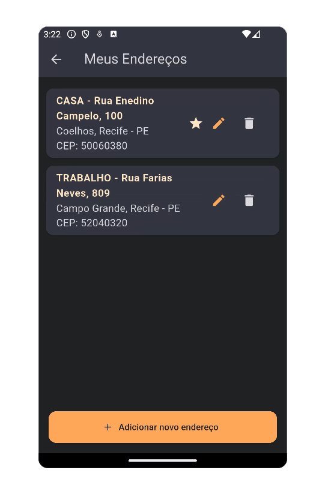
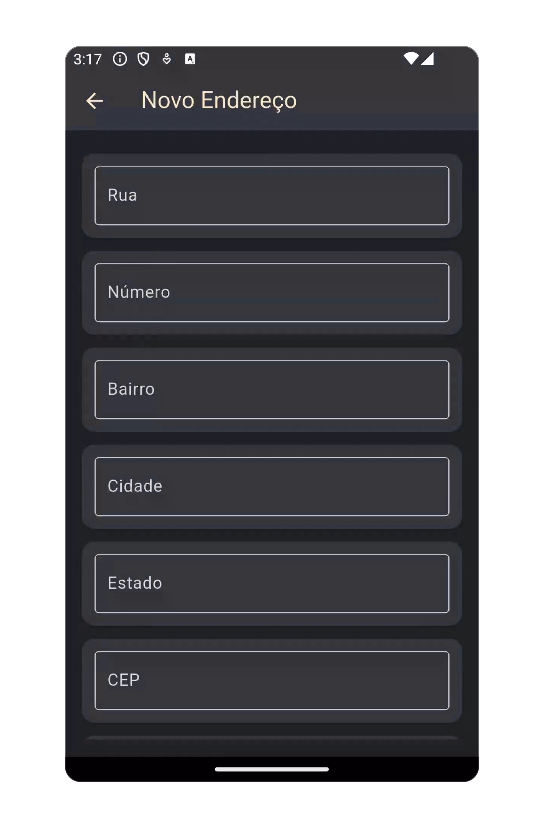
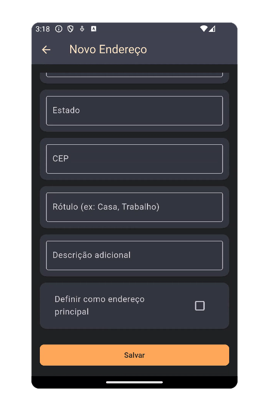

# Lista e Edição de Endereços do Usuário

| Address List | Edit address top |Edit address bottom | 
|----------------|------------------------|------------------------|
|  |  | |

> ⚠️ **Observação**:  
> Os dados exibidos nas capturas de tela foram gerados automaticamente para fins de simulação, utilizando a ferramenta gratuita [4Devs - Gerador de Pessoas](https://www.4devs.com.br/computacao).  
> Nenhuma informação real de usuário foi utilizada.

---
## `edit_address_screen.dart`

### Funcionalidade
A tela `EditAddressScreen` permite ao usuário criar ou editar um endereço. Os dados são inseridos via formulário com validações específicas (como número positivo, CEP com 8 dígitos, etc). Ao confirmar, o novo endereço é salvo por meio de uma função de callback (`onSave`) e a tela é fechada.

---
### Decisão Técnica
- **Componentização**: Campos reutilizáveis foram encapsulados no método `_buildField`, melhorando a legibilidade e evitando repetição
- **Validação customizada**: Algumas regras foram aplicadas manualmente em `_saveAddress()` além das do `Form`, permitindo mensagens de erro mais específicas
- **Formatação de entrada**: Foram utilizados `TextInputFormatter` e `MaskTextInputFormatter` para garantir que o número e o CEP sigam o formato esperado
- **Persistência temporária via controllers**: Uso de `TextEditingController` para controlar os dados digitados e reaproveitá-los ao editar um endereço já existente
- **Organização visual**: Cada campo do formulário é envolvido por `_buildCardField`, garantindo aparência consistente com o tema da aplicação
- **Design responsivo e acessível**: Formulário envolto em `ListView` com `Padding`, evitando overflow em telas pequenas


---
## Código comentado
```dart
// Tela para criar ou editar um endereço
class EditAddressScreen extends StatefulWidget {
  final Address? address; // Endereço a ser editado (pode ser nulo para criação)
  final Function(Address) onSave; // Callback ao salvar

  const EditAddressScreen({super.key, this.address, required this.onSave});

  @override
  State<EditAddressScreen> createState() => _EditAddressScreenState();
}

class _EditAddressScreenState extends State<EditAddressScreen> {
  final _formKey = GlobalKey<FormState>();

  // Controladores dos campos do formulário
  late TextEditingController streetController;
  late TextEditingController numberController;
  late TextEditingController neighborhoodController;
  late TextEditingController cityController;
  late TextEditingController stateController;
  late TextEditingController cepController;
  late TextEditingController labelController;
  late TextEditingController descriptionController;
  late bool isPrimary;

  // Máscara para o CEP (ex: 12345-678)
  final cepFormatter = MaskTextInputFormatter(
    mask: '#####-###',
    filter: {"#": RegExp(r'\d')},
  );

  // Permite apenas números no campo "Número"
  final numberFormatter = FilteringTextInputFormatter.digitsOnly;

  @override
  void initState() {
    super.initState();
    final address = widget.address;

    // Preenche os controladores com os dados do endereço, se fornecido
    streetController = TextEditingController(text: address?.street ?? '');
    numberController = TextEditingController(text: address?.number ?? '');
    neighborhoodController = TextEditingController(text: address?.neighborhood ?? '');
    cityController = TextEditingController(text: address?.city ?? '');
    stateController = TextEditingController(text: address?.state ?? '');
    cepController = TextEditingController(text: address?.cep ?? '');
    labelController = TextEditingController(text: address?.label ?? '');
    descriptionController = TextEditingController(text: address?.description ?? '');
    isPrimary = address?.isPrimary ?? false;
  }

  @override
  void dispose() {
    // Libera os recursos dos controladores
    streetController.dispose();
    numberController.dispose();
    neighborhoodController.dispose();
    cityController.dispose();
    stateController.dispose();
    cepController.dispose();
    labelController.dispose();
    descriptionController.dispose();
    super.dispose();
  }

  // Gera um campo do formulário com estilo e validação
  Widget _buildField({
    required TextEditingController controller,
    required String label,
    TextInputType keyboardType = TextInputType.text,
    bool requiredField = true,
    List<TextInputFormatter>? inputFormatters,
  }) {
    return TextFormField(
      controller: controller,
      decoration: InputDecoration(
        labelText: label,
        labelStyle: const TextStyle(color: AppColors.cardTextColor),
        border: const OutlineInputBorder(),
        filled: true,
        fillColor: AppColors.backgroundCardTextColor,
      ),
      keyboardType: keyboardType,
      inputFormatters: inputFormatters,
      style: const TextStyle(color: AppColors.cardTextColor),
      validator: requiredField
          ? (value) {
              if (value == null || value.trim().isEmpty) {
                return 'Campo obrigatório';
              }
              return null;
            }
          : null,
    );
  }

  // Envolve o campo com um Card estilizado
  Widget _buildCardField({required Widget child}) {
    return Card(
      color: AppColors.lightBackgroundColor,
      shape: RoundedRectangleBorder(borderRadius: BorderRadius.circular(12)),
      margin: const EdgeInsets.symmetric(vertical: 6),
      child: Padding(
        padding: const EdgeInsets.all(12.0),
        child: child,
      ),
    );
  }

  // Valida os campos e chama o onSave com o novo endereço
  void _saveAddress() {
    final street = streetController.text.trim();
    final number = numberController.text.trim();
    final neighborhood = neighborhoodController.text.trim();
    final city = cityController.text.trim();
    final state = stateController.text.trim();
    final cepRaw = cepController.text.replaceAll(RegExp(r'[^0-9]'), '');
    final label = labelController.text.trim();
    final description = descriptionController.text.trim();

    String? error;

    if (street.isEmpty ||
        number.isEmpty ||
        neighborhood.isEmpty ||
        city.isEmpty ||
        state.isEmpty ||
        cepRaw.isEmpty ||
        label.isEmpty) {
      error = 'Todos os campos obrigatórios devem ser preenchidos.';
    } else if (int.tryParse(number) == null || int.parse(number) <= 0) {
      error = 'Número inválido. Deve ser um valor numérico positivo.';
    } else if (cepRaw.length != 8) {
      error = 'CEP inválido. Deve conter exatamente 8 dígitos numéricos.';
    }

    if (error != null) {
      // Exibe erro na interface
      ScaffoldMessenger.of(context).showSnackBar(SnackBar(content: Text(error)));
      return;
    }

    // Cria o novo endereço
    final newAddress = Address(
      street: street,
      number: number,
      neighborhood: neighborhood,
      city: city,
      state: state,
      cep: cepRaw,
      label: label,
      description: description,
      isPrimary: isPrimary,
    );

    widget.onSave(newAddress); // Retorna para quem chamou
    Navigator.pop(context); // Fecha a tela
  }

  @override
  Widget build(BuildContext context) {
    final isEditing = widget.address != null;

    return Scaffold(
      backgroundColor: AppColors.backgroundColor,
      appBar: AppBar(
        title: Text(
          isEditing ? 'Editar Endereço' : 'Novo Endereço',
          style: const TextStyle(color: AppColors.highlightTextColor),
        ),
        backgroundColor: AppColors.lightBackgroundColor,
        iconTheme: const IconThemeData(color: AppColors.highlightTextColor),
      ),
      body: Form(
        key: _formKey,
        child: Padding(
          padding: const EdgeInsets.all(16.0),
          child: ListView(
            children: [
              _buildCardField(child: _buildField(controller: streetController, label: 'Rua')),
              _buildCardField(
                child: _buildField(
                  controller: numberController,
                  label: 'Número',
                  keyboardType: TextInputType.number,
                  inputFormatters: [numberFormatter],
                ),
              ),
              _buildCardField(child: _buildField(controller: neighborhoodController, label: 'Bairro')),
              _buildCardField(child: _buildField(controller: cityController, label: 'Cidade')),
              _buildCardField(child: _buildField(controller: stateController, label: 'Estado')),
              _buildCardField(
                child: _buildField(
                  controller: cepController,
                  label: 'CEP',
                  keyboardType: TextInputType.number,
                  inputFormatters: [cepFormatter],
                ),
              ),
              _buildCardField(child: _buildField(controller: labelController, label: 'Rótulo (ex: Casa, Trabalho)')),
              _buildCardField(
                child: _buildField(
                  controller: descriptionController,
                  label: 'Descrição adicional',
                  requiredField: false,
                ),
              ),
              _buildCardField(
                child: CheckboxListTile(
                  title: const Text(
                    'Definir como endereço principal',
                    style: TextStyle(color: AppColors.cardTextColor),
                  ),
                  value: isPrimary,
                  activeColor: AppColors.buttonsColor,
                  onChanged: (value) {
                    setState(() {
                      isPrimary = value ?? false;
                    });
                  },
                ),
              ),
              const SizedBox(height: 20),
              ElevatedButton(
                style: ElevatedButton.styleFrom(
                  backgroundColor: AppColors.buttonsColor,
                  foregroundColor: AppColors.backgroundColor,
                  shape: RoundedRectangleBorder(
                    borderRadius: BorderRadius.circular(8),
                  ),
                ),
                onPressed: () {
                  if (_formKey.currentState?.validate() ?? false) {
                    _saveAddress();
                  }
                },
                child: const Text('Salvar'),
              ),
            ],
          ),
        ),
      ),
    );
  }
}

```
---
## `address_list_screen.dart`

### Funcionalidade
Essa tela exibe todos os endereços cadastrados pelo usuário e permite:
- Visualizar os detalhes dos endereços em forma de cartões;
- Adicionar novos endereços;
- Editar endereços existentes;
- Remover endereços;
- Definir um endereço como principal (marcado com estrela ⭐).

Utiliza o `UserDataProvider` para gerenciar o estado dos endereços e garantir que a lista esteja sempre atualizada com as ações do usuário.

---
### Decisão Técnica
- **Gerenciamento de estado com Provider**: Usa o `Consumer<UserDataProvider>` para reconstruir a tela sempre que houver mudança na lista de endereços
- **Componentização leve**: Utiliza métodos auxiliares privados (`_addOrEditAddress`, `_removeAddress`, `_buildAddressCard`) para manter o build mais limpo e legível
- **Estética e UX**: Segue o padrão de cores definidos em `AppColors`, utilizando Cards com bordas arredondadas e botões com ícones para facilitar a interação do usuário
- **Reaproveitamento de tela**: Usa a tela `EditAddressScreen` tanto para adicionar quanto para editar um endereço, aproveitando a lógica de verificação do parâmetro opcional `existingAddress`

---
## Código comentado
```dart
// Lista os endereços cadastrados com opção de editar e adicionar 
class AddressListScreen extends StatelessWidget {
  const AddressListScreen({super.key});

  // Abre a tela de edição ou adição de endereço
  void _addOrEditAddress(BuildContext context, [Address? existingAddress]) {
    final userProvider = Provider.of<UserDataProvider>(context, listen: false);

    Navigator.push(
      context,
      MaterialPageRoute(
        builder: (_) => EditAddressScreen(
          address: existingAddress, // se for nulo, é um novo endereço
          onSave: (newAddress) {
            if (existingAddress != null) {
              userProvider.updateAddress(existingAddress, newAddress);
            } else {
              userProvider.addAddress(newAddress);
            }
            // Se o novo endereço for marcado como principal
            if (newAddress.isPrimary) {
              userProvider.setPrimaryAddress(newAddress);
            }
          },
        ),
      ),
    );
  }

  // Exibe diálogo de confirmação para remover um endereço
  void _removeAddress(BuildContext context, Address address) {
    final userProvider = Provider.of<UserDataProvider>(context, listen: false);

    showDialog(
      context: context,
      builder: (context) => AlertDialog(
        backgroundColor: AppColors.backgroundColor,
        title: const Text(
          'Remover endereço',
          style: TextStyle(color: AppColors.highlightTextColor),
        ),
        content: const Text(
          'Tem certeza que deseja remover este endereço?',
          style: TextStyle(color: AppColors.cardTextColor),
        ),
        actions: [
          TextButton(
            onPressed: () => Navigator.pop(context),
            child: const Text('Cancelar', style: TextStyle(color: AppColors.buttonsColor)),
          ),
          TextButton(
            onPressed: () {
              userProvider.removeAddress(address);
              Navigator.pop(context);
            },
            child: const Text('Remover', style: TextStyle(color: AppColors.highlightTextColor)),
          ),
        ],
      ),
    );
  }

  // Constrói o card de cada endereço
  Widget _buildAddressCard(BuildContext context, Address address, int index) {
    return Card(
      color: AppColors.backgroundCardTextColor,
      margin: const EdgeInsets.symmetric(vertical: 6, horizontal: 12),
      shape: RoundedRectangleBorder(borderRadius: BorderRadius.circular(12)),
      child: ListTile(
        title: Text(
          '${address.label} - ${address.street}, ${address.number}',
          style: const TextStyle(color: AppColors.highlightTextColor, fontWeight: FontWeight.bold),
        ),
        subtitle: Text(
          '${address.neighborhood}, ${address.city} - ${address.state}\nCEP: ${address.cep}',
          style: const TextStyle(color: AppColors.cardTextColor, fontSize: 16, fontWeight: FontWeight.w400),
        ),
        trailing: Row(
          mainAxisSize: MainAxisSize.min,
          children: [
            if (address.isPrimary)
              const Icon(Icons.star, color: AppColors.highlightTextColor), // ícone de endereço principal
            IconButton(
              icon: const Icon(Icons.edit, color: AppColors.buttonsColor),
              onPressed: () => _addOrEditAddress(context, address),
            ),
            IconButton(
              icon: const Icon(Icons.delete, color: AppColors.cardTextColor),
              onPressed: () => _removeAddress(context, address),
            ),
          ],
        ),
        onTap: () => _addOrEditAddress(context, address), // edição rápida ao tocar no card
      ),
    );
  }

  @override
  Widget build(BuildContext context) {
    return Consumer<UserDataProvider>(
      builder: (context, userProvider, child) {
        final addresses = userProvider.addresses;

        return Scaffold(
          backgroundColor: AppColors.backgroundColor,
          appBar: AppBar(
            title: const Text('Meus Endereços'),
            backgroundColor: AppColors.lightBackgroundColor,
            foregroundColor: AppColors.cardTextColor,
          ),
          body: Column(
            children: [
              // Lista de endereços ou mensagem vazia
              Expanded(
                child: addresses.isEmpty
                    ? const Center(
                        child: Text(
                          'Nenhum endereço cadastrado.',
                          style: TextStyle(color: AppColors.cardTextColor),
                        ),
                      )
                    : ListView.builder(
                        padding: const EdgeInsets.symmetric(vertical: 12),
                        itemCount: addresses.length,
                        itemBuilder: (context, index) => _buildAddressCard(
                          context,
                          addresses[index],
                          index,
                        ),
                      ),
              ),
              // Botão de adicionar novo endereço
              Padding(
                padding: const EdgeInsets.fromLTRB(16, 0, 16, 16),
                child: ElevatedButton.icon(
                  onPressed: () => _addOrEditAddress(context),
                  icon: const Icon(Icons.add),
                  label: const Text('Adicionar novo endereço'),
                  style: ElevatedButton.styleFrom(
                    backgroundColor: AppColors.buttonsColor,
                    foregroundColor: AppColors.backgroundColor,
                    minimumSize: const Size.fromHeight(50),
                    shape: RoundedRectangleBorder(
                      borderRadius: BorderRadius.circular(12),
                    ),
                  ),
                ),
              ),
            ],
          ),
        );
      },
    );
  }
}
