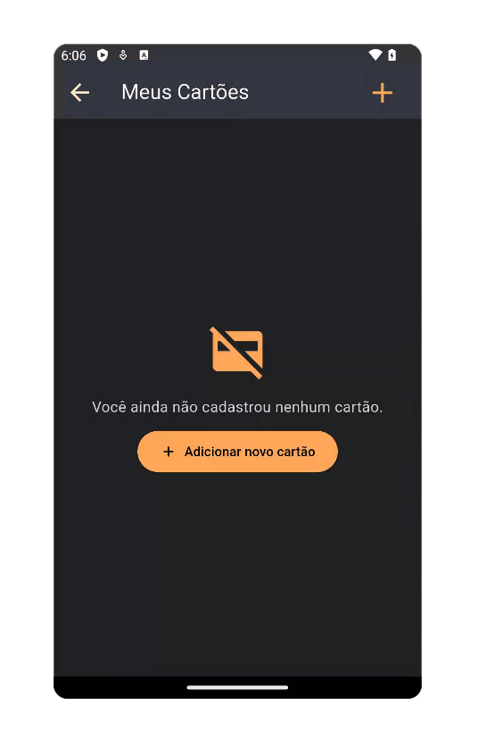
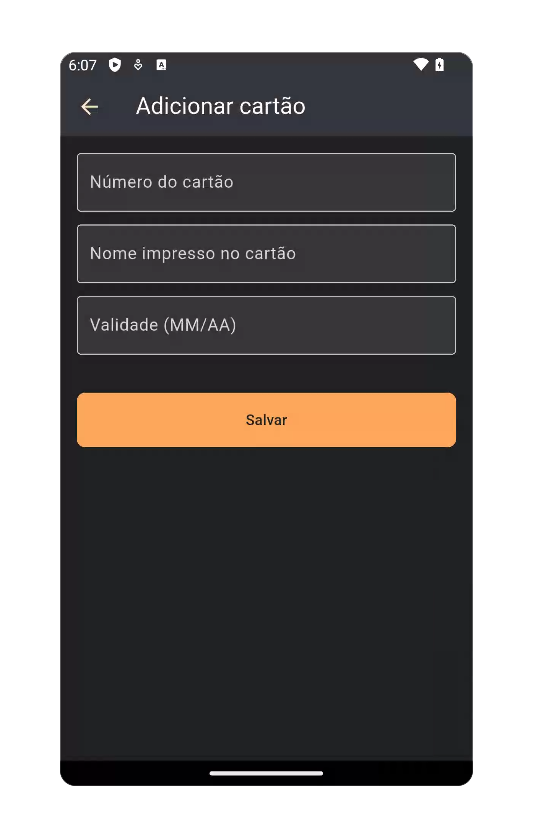
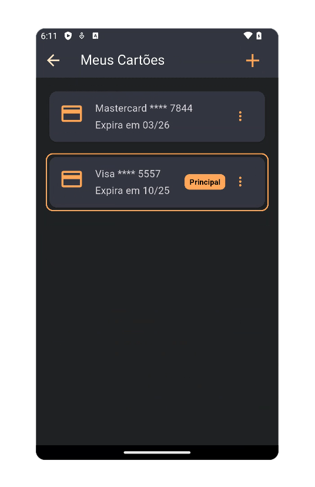

# Gerenciamento de Cartões de Crédito do Usuário
No aplicativo TechTaste, os usuários podem adicionar e editar informações de cartão de crédito diretamente através da seção de conta (`AccountScreen`). Esta funcionalidade permite que o usuário cadastre cartões válidos que serão utilizados no processo de pagamento durante o checkout.

A lógica de gerenciamento de cartões está centralizada em dois pontos principais:
- `AddCreditCardScreen` – tela de formulário para cadastro de um cartão
- `CreditCardListScreen` – exibe os cartões salvos com opção de adição/exclusão

| Empty Credit Card List | Add Credit Card | Credit Card List Mockup |
|----------------|------------------------|------------------------|
|  |  | |


> ⚠️ **Observação**:  
> Os dados exibidos nas capturas de tela foram gerados automaticamente para fins de simulação, utilizando a ferramenta gratuita [4Devs - Gerador de Pessoas](https://www.4devs.com.br/computacao).  
> Nenhuma informação real de usuário foi utilizada.

---
## `credit_card_form_screen.dart`

### Funcionalidade
Esta tela permite ao usuário adicionar um cartão de crédito. 
O formulário coleta três informações principais: número do cartão, nome impresso no cartão e data de validade. 
Após a validação dos campos, um novo objeto `CreditCard` é criado e salvo no `UserDataProvider`.

---
### Decisão Técnica
- **Máscaras e formatações**: Utiliza o pacote `flutter_multi_formatter` para aplicar máscaras nos campos de número do cartão e validade
- **Validação de dados**: A lógica de validação inclui verificação do comprimento do número do cartão, formato da validade (MM/AA), validade futura e nome preenchido
- **Design reutilizável**: O método privado `_buildField()` centraliza a criação dos campos de texto, aplicando estilos e formatação consistente
- **Gerenciamento de estado**: Utiliza `Provider` para acessar e modificar a lista de cartões do usuário via `UserDataProvider`
- **Experiência do usuário**: Apresenta feedback visual por meio de `SnackBar` em caso de sucesso ou erro no formulário

---
## Código comentado
```dart
// Tela com formulário para adicionar cartão de crédito
class AddCreditCardScreen extends StatefulWidget {

// possibilidade de editar cartão existente
// na lógica atual do app foi colocado apenas adição/remoção na lista de cartões
  final CreditCard? existingCard; 

  const AddCreditCardScreen({super.key, this.existingCard});

  @override
  State<AddCreditCardScreen> createState() => _AddCreditCardScreenState();
}

class _AddCreditCardScreenState extends State<AddCreditCardScreen> {
  // Controladores dos campos de entrada
  final TextEditingController cardNumberController = TextEditingController();
  final TextEditingController cardNameController = TextEditingController();
  final TextEditingController cardExpiryController = TextEditingController();

  @override
  void initState() {
    super.initState();
    // Se estiver editando, preencher os campos com os dados existentes
    if (widget.existingCard != null) {
      final card = widget.existingCard!;
      cardNameController.text = card.cardName;
      cardExpiryController.text = card.expiryDate;
      cardNumberController.text = '•••• •••• •••• ${card.last4Digits}';
    }
  }

  @override
  void dispose() {
    // Liberar memória ao destruir a tela
    cardNumberController.dispose();
    cardNameController.dispose();
    cardExpiryController.dispose();
    super.dispose();
  }

  // Widget reutilizável para os campos de entrada
  Widget _buildField({
    required TextEditingController controller,
    required String label,
    TextInputType keyboardType = TextInputType.text,
    List<TextInputFormatter>? inputFormatters,
  }) {
    return Padding(
      padding: const EdgeInsets.only(bottom: 12.0),
      child: TextField(
        controller: controller,
        keyboardType: keyboardType,
        inputFormatters: inputFormatters,
        decoration: InputDecoration(
          labelText: label,
          labelStyle: const TextStyle(color: AppColors.cardTextColor),
          border: const OutlineInputBorder(),
          filled: true,
          fillColor: AppColors.backgroundCardTextColor,
        ),
        style: const TextStyle(color: AppColors.cardTextColor),
      ),
    );
  }

  // Função de salvar (ou atualizar) o cartão
  void _saveCard() {
    final fullNumber = toNumericString(cardNumberController.text.trim());
    final expiry = cardExpiryController.text.trim();
    final name = cardNameController.text.trim();

    // Validação do número do cartão
    if (fullNumber.length < 16) {
      _showError('Número do cartão inválido');
      return;
    }

    // Validação do formato da validade (MM/AA)
    if (!RegExp(r'^[0-9]{2}/[0-9]{2}$').hasMatch(expiry)) {
      _showError('Validade inválida. Use MM/AA.');
      return;
    }

    // Validação da data de validade (futura)
    final parts = expiry.split('/');
    final int expMonth = int.tryParse(parts[0]) ?? 0;
    final int expYear = int.tryParse(parts[1]) ?? 0;
    final DateTime now = DateTime.now();
    final int currentYear = now.year % 100;
    final int currentMonth = now.month;

    if (expMonth < 1 || expMonth > 12) {
      _showError('Mês de validade inválido.');
      return;
    }

    if (expYear < currentYear || (expYear == currentYear && expMonth < currentMonth)) {
      _showError('Cartão expirado.');
      return;
    }

    // Validação do nome
    if (name.isEmpty) {
      _showError('Digite o nome no cartão.');
      return;
    }

    // Criação do novo cartão
    final last4 = fullNumber.substring(fullNumber.length - 4);
    final newCard = CreditCard(
      cardName: name,
      expiryDate: expiry,
      last4Digits: last4,
      brand: _detectCardBrand(fullNumber),
      isPrimary: false, // Sempre começa como secundário
    );

    // Adição do cartão ao provider
    final userDataProvider = Provider.of<UserDataProvider>(
      context,
      listen: false,
    );
    userDataProvider.addCreditCard(newCard);

    // Feedback para o usuário e retorno à tela anterior
    ScaffoldMessenger.of(context).showSnackBar(
      const SnackBar(content: Text('Cartão salvo com sucesso!')),
    );
    Navigator.pop(context);
  }

  // Exibe uma mensagem de erro via SnackBar
  void _showError(String message) {
    ScaffoldMessenger.of(context).showSnackBar(SnackBar(content: Text(message)));
  }

  // Detecção simples da bandeira do cartão com base no prefixo
  String _detectCardBrand(String number) {
    if (number.startsWith('4')) return 'Visa';
    if (number.startsWith('5')) return 'Mastercard';
    if (number.startsWith('3')) return 'Amex';
    return 'Desconhecida';
  }

  @override
  Widget build(BuildContext context) {
    return Scaffold(
      backgroundColor: AppColors.backgroundColor,
      appBar: AppBar(
        title: const Text('Adicionar cartão'),
        backgroundColor: AppColors.lightBackgroundColor,
        iconTheme: const IconThemeData(color: AppColors.highlightTextColor),
        titleTextStyle: AppTextStyles.titleLargeWhite,
      ),
      body: Padding(
        padding: const EdgeInsets.all(16.0),
        child: Column(
          crossAxisAlignment: CrossAxisAlignment.stretch,
          children: [
            _buildField(
              controller: cardNumberController,
              label: 'Número do cartão',
              keyboardType: TextInputType.number,
              inputFormatters: [CreditCardNumberInputFormatter()],
            ),
            _buildField(
              controller: cardNameController,
              label: 'Nome impresso no cartão',
            ),
            _buildField(
              controller: cardExpiryController,
              label: 'Validade (MM/AA)',
              keyboardType: TextInputType.datetime,
              inputFormatters: [CreditCardExpirationDateFormatter()],
            ),
            const SizedBox(height: 24),
            ElevatedButton(
              style: ElevatedButton.styleFrom(
                backgroundColor: AppColors.buttonsColor,
                foregroundColor: AppColors.backgroundColor,
                shape: RoundedRectangleBorder(
                  borderRadius: BorderRadius.circular(8),
                ),
                padding: const EdgeInsets.symmetric(vertical: 16),
              ),
              onPressed: _saveCard,
              child: Text(widget.existingCard == null ? 'Salvar' : 'Atualizar'),
            ),
          ],
        ),
      ),
    );
  }
}


```
---
## `credit_card_list_screen.dart`

### Funcionalidade
A `CreditCardListScreen` é responsável por exibir a lista de cartões de crédito cadastrados pelo usuário. Nela, o usuário pode:
- Ver seus cartões com marca e dados parciais (últimos 4 dígitos, validade);
- Definir um cartão como principal;
- Excluir um cartão salvo;
- Navegar para a tela de cadastro de um novo cartão (`AddCreditCardScreen`).

---
### Decisão Técnica
- **Gerenciamento de estado**: Utiliza `Provider` (`UserDataProvider`) para acessar e modificar a lista de cartões salvos
- **Reatividade**: A interface se atualiza automaticamente ao adicionar/remover cartões ou alterar o principal
- **Navegação**: O botão `+` no `AppBar` e no corpo vazio usam Navigator.push para abrir a tela de cadastro de cartão
- **Acessibilidade Visual**:Cartões marcados como principal recebem destaque visual (borda colorida e etiqueta “Principal”)
- **UX Melhorada**:Mensagem amigável e botão de ação são exibidos quando não há cartões cadastrados

---
## Código comentado
```dart
// Tela para cadastrar/listar os cartões de crédito 
class CreditCardListScreen extends StatelessWidget {
  const CreditCardListScreen({super.key});

  @override
  Widget build(BuildContext context) {
    // Obtém a instância do provider com os dados do usuário
    final userDataProvider = Provider.of<UserDataProvider>(context);
    final cards = userDataProvider.creditCards;

    return Scaffold(
      appBar: AppBar(
        backgroundColor: AppColors.lightBackgroundColor,
        iconTheme: const IconThemeData(
          color: AppColors.highlightTextColor,
          size: 30,
        ),
        title: Row(
          mainAxisAlignment: MainAxisAlignment.spaceBetween,
          children: [
            Text('Meus Cartões', style: AppTextStyles.titleLargeWhite),
            IconButton(
              icon: const Icon(Icons.add, size: 36, color: AppColors.buttonsColor),
              onPressed: () {
                // Navega para a tela de cadastro de cartão
                Navigator.push(
                  context,
                  MaterialPageRoute(builder: (_) => AddCreditCardScreen()),
                );
              },
            ),
          ],
        ),
      ),

      backgroundColor: AppColors.backgroundColor,

      body: cards.isEmpty
        ? _buildEmptyState(context)
        : _buildCardList(cards, context, userDataProvider),
    );
  }

  // Widget para estado vazio (sem cartões cadastrados)
  Widget _buildEmptyState(BuildContext context) {
    return Center(
      child: Padding(
        padding: const EdgeInsets.all(24),
        child: Column(
          mainAxisAlignment: MainAxisAlignment.center,
          children: [
            const Icon(Icons.credit_card_off, size: 64, color: AppColors.buttonsColor),
            const SizedBox(height: 16),
            Text('Você ainda não cadastrou nenhum cartão.',
                style: AppTextStyles.body, textAlign: TextAlign.center),
            const SizedBox(height: 12),
            ElevatedButton.icon(
              style: ElevatedButton.styleFrom(
                backgroundColor: AppColors.buttonsColor,
                padding: const EdgeInsets.symmetric(horizontal: 24, vertical: 12),
              ),
              onPressed: () {
                Navigator.push(context,
                  MaterialPageRoute(builder: (_) => AddCreditCardScreen()));
              },
              icon: const Icon(Icons.add),
              label: const Text('Adicionar novo cartão'),
            ),
          ],
        ),
      ),
    );
  }

  // Widget para construir a lista de cartões
  Widget _buildCardList(List<CreditCard> cards, BuildContext context, UserDataProvider userDataProvider) {
    return ListView.separated(
      padding: const EdgeInsets.all(16),
      separatorBuilder: (_, __) => const SizedBox(height: 12),
      itemCount: cards.length,
      itemBuilder: (context, index) {
        final card = cards[index];

        return Container(
          decoration: BoxDecoration(
            border: Border.all(
              color: card.isPrimary ? AppColors.mainColor : Colors.transparent,
              width: 2,
            ),
            borderRadius: BorderRadius.circular(12),
          ),
          child: Stack(
            children: [
              // Cartão visual
              Card(
                color: AppColors.backgroundCardTextColor,
                shape: RoundedRectangleBorder(borderRadius: BorderRadius.circular(12)),
                child: Padding(
                  padding: const EdgeInsets.all(16),
                  child: Row(
                    crossAxisAlignment: CrossAxisAlignment.start,
                    children: [
                      Icon(
                        card.brand == 'Visa' || card.brand == 'Mastercard'
                          ? Icons.credit_card
                          : Icons.payment,
                        color: AppColors.buttonsColor,
                        size: 40,
                      ),
                      const SizedBox(width: 18),
                      Expanded(
                        child: Column(
                          crossAxisAlignment: CrossAxisAlignment.start,
                          children: [
                            Text('${card.brand} **** ${card.last4Digits}',
                              style: AppTextStyles.body,
                              overflow: TextOverflow.ellipsis),
                            const SizedBox(height: 4),
                            Text('Expira em ${card.expiryDate}',
                                style: AppTextStyles.body),
                          ],
                        ),
                      ),
                      // Menu de opções
                      PopupMenuButton<String>(
                        icon: const Icon(Icons.more_vert, color: AppColors.buttonsColor),
                        color: Colors.black87,
                        surfaceTintColor: Colors.black87,
                        onSelected: (value) {
                          if (value == 'primary') {
                            userDataProvider.setPrimaryCard(card);
                          } else if (value == 'delete') {
                            _confirmDeleteCard(context, card);
                          }
                        },
                        itemBuilder: (context) => [
                          PopupMenuItem(
                            value: 'primary',
                            child: Row(
                              children: [
                                Icon(card.isPrimary ? Icons.star : Icons.star_border, color: Colors.amber),
                                const SizedBox(width: 8),
                                Text(card.isPrimary
                                    ? 'Cartão principal'
                                    : 'Definir como principal'),
                              ],
                            ),
                          ),
                          const PopupMenuItem(
                            value: 'delete',
                            child: Row(
                              children: [
                                Icon(Icons.delete, color: Colors.redAccent),
                                SizedBox(width: 8),
                                Text('Remover'),
                              ],
                            ),
                          ),
                        ],
                      ),
                    ],
                  ),
                ),
              ),
              // Etiqueta de cartão principal
              if (card.isPrimary)
                Positioned(
                  bottom: 33,
                  right: 68,
                  child: Container(
                    padding: const EdgeInsets.symmetric(horizontal: 8, vertical: 4),
                    decoration: BoxDecoration(
                      color: AppColors.mainColor,
                      borderRadius: BorderRadius.circular(8),
                    ),
                    child: const Text(
                      'Principal',
                      style: TextStyle(
                        fontWeight: FontWeight.bold,
                        color: Colors.black,
                        fontSize: 12,
                      ),
                    ),
                  ),
                ),
            ],
          ),
        );
      },
    );
  }

  // Confirmação de exclusão de cartão
  void _confirmDeleteCard(BuildContext context, CreditCard card) {
    showDialog(
      context: context,
      builder: (ctx) => AlertDialog(
        title: const Text('Excluir cartão'),
        content: const Text('Tem certeza que deseja remover este cartão?'),
        actions: [
          TextButton(
            child: const Text('Cancelar'),
            onPressed: () => Navigator.pop(ctx),
          ),
          ElevatedButton(
            style: ElevatedButton.styleFrom(backgroundColor: AppColors.buttonsColor),
            child: const Text('Excluir'),
            onPressed: () {
              Provider.of<UserDataProvider>(context, listen: false).removeCreditCard(card);
              Navigator.pop(ctx);
              ScaffoldMessenger.of(context).showSnackBar(
                const SnackBar(content: Text('Cartão removido com sucesso!')),
              );
            },
          ),
        ],
      ),
    );
  }
}
