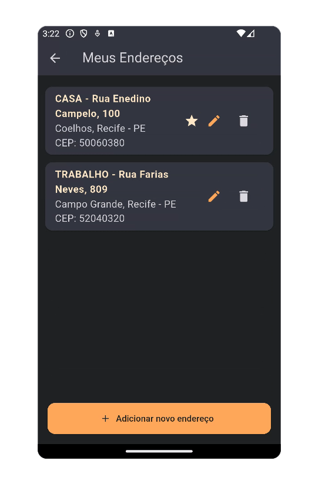

# Gerenciamento de Cartões de Crédito do Usuário
No aplicativo TechTaste, os usuários podem adicionar e editar informações de cartão de crédito diretamente através da seção de conta (`AccountScreen`). Esta funcionalidade permite que o usuário cadastre cartões válidos que serão utilizados no processo de pagamento durante o checkout.

A lógica de gerenciamento de cartões está centralizada em dois pontos principais:
- `AddCreditCardScreen` – tela de formulário para cadastro de um cartão
- `CreditCardListScreen` – exibe os cartões salvos com opção de adição/exclusão

| Credit Card List | Add Credit Card |
|----------------|------------------------|
|  |  |


> ⚠️ **Observação**:  
> Os dados exibidos nas capturas de tela foram gerados automaticamente para fins de simulação, utilizando a ferramenta gratuita [4Devs - Gerador de Pessoas](https://www.4devs.com.br/computacao).  
> Nenhuma informação real de usuário foi utilizada.

---
## `credit_card_form_screen.dart`

### Funcionalidade
Esta tela permite ao usuário adicionar um cartão de crédito. 
O formulário coleta três informações principais: número do cartão, nome impresso no cartão e data de validade. 
Após a validação dos campos, um novo objeto `CreditCard` é criado e salvo no `UserDataProvider`.

---
### Decisão Técnica
- **Máscaras e formatações**: Utiliza o pacote `flutter_multi_formatter` para aplicar máscaras nos campos de número do cartão e validade
- **Validação de dados**: A lógica de validação inclui verificação do comprimento do número do cartão, formato da validade (MM/AA), validade futura e nome preenchido
- **Design reutilizável**: O método privado `_buildField()` centraliza a criação dos campos de texto, aplicando estilos e formatação consistente
- **Gerenciamento de estado**: Utiliza `Provider` para acessar e modificar a lista de cartões do usuário via `UserDataProvider`
- **Experiência do usuário**: Apresenta feedback visual por meio de `SnackBar` em caso de sucesso ou erro no formulário

---
## Código comentado
```dart
// Tela com formulário para adicionar cartão de crédito
class AddCreditCardScreen extends StatefulWidget {

// possibilidade de editar cartão existente
// na lógica atual do app foi colocado apenas adição/remoção na lista de cartões
  final CreditCard? existingCard; 

  const AddCreditCardScreen({super.key, this.existingCard});

  @override
  State<AddCreditCardScreen> createState() => _AddCreditCardScreenState();
}

class _AddCreditCardScreenState extends State<AddCreditCardScreen> {
  // Controladores dos campos de entrada
  final TextEditingController cardNumberController = TextEditingController();
  final TextEditingController cardNameController = TextEditingController();
  final TextEditingController cardExpiryController = TextEditingController();

  @override
  void initState() {
    super.initState();
    // Se estiver editando, preencher os campos com os dados existentes
    if (widget.existingCard != null) {
      final card = widget.existingCard!;
      cardNameController.text = card.cardName;
      cardExpiryController.text = card.expiryDate;
      cardNumberController.text = '•••• •••• •••• ${card.last4Digits}';
    }
  }

  @override
  void dispose() {
    // Liberar memória ao destruir a tela
    cardNumberController.dispose();
    cardNameController.dispose();
    cardExpiryController.dispose();
    super.dispose();
  }

  // Widget reutilizável para os campos de entrada
  Widget _buildField({
    required TextEditingController controller,
    required String label,
    TextInputType keyboardType = TextInputType.text,
    List<TextInputFormatter>? inputFormatters,
  }) {
    return Padding(
      padding: const EdgeInsets.only(bottom: 12.0),
      child: TextField(
        controller: controller,
        keyboardType: keyboardType,
        inputFormatters: inputFormatters,
        decoration: InputDecoration(
          labelText: label,
          labelStyle: const TextStyle(color: AppColors.cardTextColor),
          border: const OutlineInputBorder(),
          filled: true,
          fillColor: AppColors.backgroundCardTextColor,
        ),
        style: const TextStyle(color: AppColors.cardTextColor),
      ),
    );
  }

  // Função de salvar (ou atualizar) o cartão
  void _saveCard() {
    final fullNumber = toNumericString(cardNumberController.text.trim());
    final expiry = cardExpiryController.text.trim();
    final name = cardNameController.text.trim();

    // Validação do número do cartão
    if (fullNumber.length < 16) {
      _showError('Número do cartão inválido');
      return;
    }

    // Validação do formato da validade (MM/AA)
    if (!RegExp(r'^[0-9]{2}/[0-9]{2}$').hasMatch(expiry)) {
      _showError('Validade inválida. Use MM/AA.');
      return;
    }

    // Validação da data de validade (futura)
    final parts = expiry.split('/');
    final int expMonth = int.tryParse(parts[0]) ?? 0;
    final int expYear = int.tryParse(parts[1]) ?? 0;
    final DateTime now = DateTime.now();
    final int currentYear = now.year % 100;
    final int currentMonth = now.month;

    if (expMonth < 1 || expMonth > 12) {
      _showError('Mês de validade inválido.');
      return;
    }

    if (expYear < currentYear || (expYear == currentYear && expMonth < currentMonth)) {
      _showError('Cartão expirado.');
      return;
    }

    // Validação do nome
    if (name.isEmpty) {
      _showError('Digite o nome no cartão.');
      return;
    }

    // Criação do novo cartão
    final last4 = fullNumber.substring(fullNumber.length - 4);
    final newCard = CreditCard(
      cardName: name,
      expiryDate: expiry,
      last4Digits: last4,
      brand: _detectCardBrand(fullNumber),
      isPrimary: false, // Sempre começa como secundário
    );

    // Adição do cartão ao provider
    final userDataProvider = Provider.of<UserDataProvider>(
      context,
      listen: false,
    );
    userDataProvider.addCreditCard(newCard);

    // Feedback para o usuário e retorno à tela anterior
    ScaffoldMessenger.of(context).showSnackBar(
      const SnackBar(content: Text('Cartão salvo com sucesso!')),
    );
    Navigator.pop(context);
  }

  // Exibe uma mensagem de erro via SnackBar
  void _showError(String message) {
    ScaffoldMessenger.of(context).showSnackBar(SnackBar(content: Text(message)));
  }

  // Detecção simples da bandeira do cartão com base no prefixo
  String _detectCardBrand(String number) {
    if (number.startsWith('4')) return 'Visa';
    if (number.startsWith('5')) return 'Mastercard';
    if (number.startsWith('3')) return 'Amex';
    return 'Desconhecida';
  }

  @override
  Widget build(BuildContext context) {
    return Scaffold(
      backgroundColor: AppColors.backgroundColor,
      appBar: AppBar(
        title: const Text('Adicionar cartão'),
        backgroundColor: AppColors.lightBackgroundColor,
        iconTheme: const IconThemeData(color: AppColors.highlightTextColor),
        titleTextStyle: AppTextStyles.titleLargeWhite,
      ),
      body: Padding(
        padding: const EdgeInsets.all(16.0),
        child: Column(
          crossAxisAlignment: CrossAxisAlignment.stretch,
          children: [
            _buildField(
              controller: cardNumberController,
              label: 'Número do cartão',
              keyboardType: TextInputType.number,
              inputFormatters: [CreditCardNumberInputFormatter()],
            ),
            _buildField(
              controller: cardNameController,
              label: 'Nome impresso no cartão',
            ),
            _buildField(
              controller: cardExpiryController,
              label: 'Validade (MM/AA)',
              keyboardType: TextInputType.datetime,
              inputFormatters: [CreditCardExpirationDateFormatter()],
            ),
            const SizedBox(height: 24),
            ElevatedButton(
              style: ElevatedButton.styleFrom(
                backgroundColor: AppColors.buttonsColor,
                foregroundColor: AppColors.backgroundColor,
                shape: RoundedRectangleBorder(
                  borderRadius: BorderRadius.circular(8),
                ),
                padding: const EdgeInsets.symmetric(vertical: 16),
              ),
              onPressed: _saveCard,
              child: Text(widget.existingCard == null ? 'Salvar' : 'Atualizar'),
            ),
          ],
        ),
      ),
    );
  }
}


```
---
## `address_list_screen.dart`

### Funcionalidade
Essa tela exibe todos os endereços cadastrados pelo usuário e permite:
- Visualizar os detalhes dos endereços em forma de cartões;
- Adicionar novos endereços;
- Editar endereços existentes;
- Remover endereços;
- Definir um endereço como principal (marcado com estrela ⭐).

Utiliza o `UserDataProvider` para gerenciar o estado dos endereços e garantir que a lista esteja sempre atualizada com as ações do usuário.

---
### Decisão Técnica
- **Gerenciamento de estado com Provider**: Usa o `Consumer<UserDataProvider>` para reconstruir a tela sempre que houver mudança na lista de endereços
- **Componentização leve**: Utiliza métodos auxiliares privados (`_addOrEditAddress`, `_removeAddress`, `_buildAddressCard`) para manter o build mais limpo e legível
- **Estética e UX**: Segue o padrão de cores definidos em `AppColors`, utilizando Cards com bordas arredondadas e botões com ícones para facilitar a interação do usuário
- **Reaproveitamento de tela**: Usa a tela `EditAddressScreen` tanto para adicionar quanto para editar um endereço, aproveitando a lógica de verificação do parâmetro opcional `existingAddress`

---
## Código comentado
```dart
// Lista os endereços cadastrados com opção de editar e adicionar 
class AddressListScreen extends StatelessWidget {
  const AddressListScreen({super.key});

  // Abre a tela de edição ou adição de endereço
  void _addOrEditAddress(BuildContext context, [Address? existingAddress]) {
    final userProvider = Provider.of<UserDataProvider>(context, listen: false);

    Navigator.push(
      context,
      MaterialPageRoute(
        builder: (_) => EditAddressScreen(
          address: existingAddress, // se for nulo, é um novo endereço
          onSave: (newAddress) {
            if (existingAddress != null) {
              userProvider.updateAddress(existingAddress, newAddress);
            } else {
              userProvider.addAddress(newAddress);
            }
            // Se o novo endereço for marcado como principal
            if (newAddress.isPrimary) {
              userProvider.setPrimaryAddress(newAddress);
            }
          },
        ),
      ),
    );
  }

  // Exibe diálogo de confirmação para remover um endereço
  void _removeAddress(BuildContext context, Address address) {
    final userProvider = Provider.of<UserDataProvider>(context, listen: false);

    showDialog(
      context: context,
      builder: (context) => AlertDialog(
        backgroundColor: AppColors.backgroundColor,
        title: const Text(
          'Remover endereço',
          style: TextStyle(color: AppColors.highlightTextColor),
        ),
        content: const Text(
          'Tem certeza que deseja remover este endereço?',
          style: TextStyle(color: AppColors.cardTextColor),
        ),
        actions: [
          TextButton(
            onPressed: () => Navigator.pop(context),
            child: const Text('Cancelar', style: TextStyle(color: AppColors.buttonsColor)),
          ),
          TextButton(
            onPressed: () {
              userProvider.removeAddress(address);
              Navigator.pop(context);
            },
            child: const Text('Remover', style: TextStyle(color: AppColors.highlightTextColor)),
          ),
        ],
      ),
    );
  }

  // Constrói o card de cada endereço
  Widget _buildAddressCard(BuildContext context, Address address, int index) {
    return Card(
      color: AppColors.backgroundCardTextColor,
      margin: const EdgeInsets.symmetric(vertical: 6, horizontal: 12),
      shape: RoundedRectangleBorder(borderRadius: BorderRadius.circular(12)),
      child: ListTile(
        title: Text(
          '${address.label} - ${address.street}, ${address.number}',
          style: const TextStyle(color: AppColors.highlightTextColor, fontWeight: FontWeight.bold),
        ),
        subtitle: Text(
          '${address.neighborhood}, ${address.city} - ${address.state}\nCEP: ${address.cep}',
          style: const TextStyle(color: AppColors.cardTextColor, fontSize: 16, fontWeight: FontWeight.w400),
        ),
        trailing: Row(
          mainAxisSize: MainAxisSize.min,
          children: [
            if (address.isPrimary)
              const Icon(Icons.star, color: AppColors.highlightTextColor), // ícone de endereço principal
            IconButton(
              icon: const Icon(Icons.edit, color: AppColors.buttonsColor),
              onPressed: () => _addOrEditAddress(context, address),
            ),
            IconButton(
              icon: const Icon(Icons.delete, color: AppColors.cardTextColor),
              onPressed: () => _removeAddress(context, address),
            ),
          ],
        ),
        onTap: () => _addOrEditAddress(context, address), // edição rápida ao tocar no card
      ),
    );
  }

  @override
  Widget build(BuildContext context) {
    return Consumer<UserDataProvider>(
      builder: (context, userProvider, child) {
        final addresses = userProvider.addresses;

        return Scaffold(
          backgroundColor: AppColors.backgroundColor,
          appBar: AppBar(
            title: const Text('Meus Endereços'),
            backgroundColor: AppColors.lightBackgroundColor,
            foregroundColor: AppColors.cardTextColor,
          ),
          body: Column(
            children: [
              // Lista de endereços ou mensagem vazia
              Expanded(
                child: addresses.isEmpty
                    ? const Center(
                        child: Text(
                          'Nenhum endereço cadastrado.',
                          style: TextStyle(color: AppColors.cardTextColor),
                        ),
                      )
                    : ListView.builder(
                        padding: const EdgeInsets.symmetric(vertical: 12),
                        itemCount: addresses.length,
                        itemBuilder: (context, index) => _buildAddressCard(
                          context,
                          addresses[index],
                          index,
                        ),
                      ),
              ),
              // Botão de adicionar novo endereço
              Padding(
                padding: const EdgeInsets.fromLTRB(16, 0, 16, 16),
                child: ElevatedButton.icon(
                  onPressed: () => _addOrEditAddress(context),
                  icon: const Icon(Icons.add),
                  label: const Text('Adicionar novo endereço'),
                  style: ElevatedButton.styleFrom(
                    backgroundColor: AppColors.buttonsColor,
                    foregroundColor: AppColors.backgroundColor,
                    minimumSize: const Size.fromHeight(50),
                    shape: RoundedRectangleBorder(
                      borderRadius: BorderRadius.circular(12),
                    ),
                  ),
                ),
              ),
            ],
          ),
        );
      },
    );
  }
}
