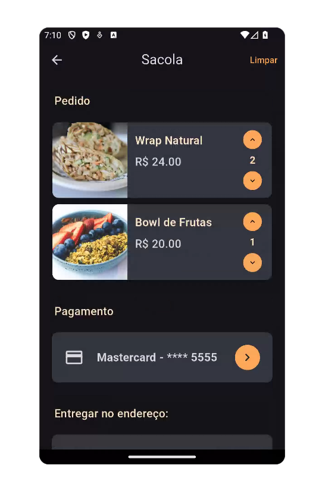
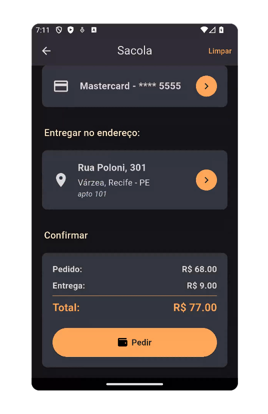
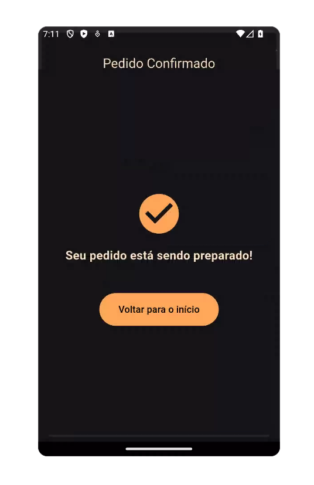

# Pasta `checkout/`

| Checkout Screen top |  Checkout Screen bottom  |  Checkout Screen finalização  | 
|----------------|------------------------|------------------------|
|  |  | |

> ⚠️ **Observação**:  
> Os dados exibidos nas capturas de tela foram gerados automaticamente para fins de simulação, utilizando a ferramenta gratuita [4Devs - Gerador de Pessoas](https://www.4devs.com.br/computacao).  
> Nenhuma informação real de usuário foi utilizada.

## Funcionalidade
Este módulo é responsável por gerenciar o **fluxo de checkout**, permitindo que o usuário:

- Revise o pedido e os itens da sacola;
- Escolha ou altere o endereço de entrega;
- Selecione o método de pagamento (cartão, dinheiro ou Pix);
- Informe o troco (caso escolha pagamento em dinheiro);
- Finalize e confirme o pedido.

---
## Decisão Técnica
- A **taxa de entrega** (frete) é calculada utilizando a função `calcularFrete()`, presente em `frete_utils.dart`, com base na distância (em km) mockada em JSON.
- O método de pagamento via cartão de crédito está integrado aos dados salvos na conta do usuário.
- O valor total do pedido, exibido em `order_summary_card.dart`, inclui:
  - Subtotal (soma dos valores dos pratos);
  - Taxa de entrega (frete);
  - Valor de troco esperado, caso o pagamento seja em dinheiro.

---
## Estrutura de Arquivos

### Visão Geral das Telas
| Tela                             | Descrição                                                                                          |
|----------------------------------|------------------------------------------------------------------------------------------------------|
| `checkout_screen.dart`           | Tela principal de finalização do pedido. Mostra o resumo da compra, endereço e forma de pagamento. |
| `order_confirmation_screen.dart` | Exibe a confirmação do pedido após a finalização.                                                   |
| `payment_selection_screen.dart`  | Permite ao usuário escolher entre pagamento com cartão, dinheiro ou Pix.                           |
| `select_address_screen.dart`     | Permite selecionar um endereço salvo ou adicionar um novo.                                          |
| `select_cash_change_screen.dart` | Caso o pagamento seja em dinheiro, permite informar o valor para troco.                            |
| `select_credit_card_screen.dart` | Permite escolher um cartão de crédito para o pagamento.                                             |


### Visão geral dos widgets
| Widget                      | Descrição                                                                      |
|-----------------------------|----------------------------------------------------------------------------------|
| `address_card.dart`         | Exibe o endereço do usuário em formato de card, permitindo seleção.            |
| `bag_items_list.dart`       | Lista os itens presentes na sacola de compras.                                 |
| `clean_button_bag.dart`     | Botão que permite limpar todos os itens da sacola.                             |
| `order_summary_card.dart`   | Mostra os valores do pedido: subtotal, taxa de entrega e total.                |
| `payment_method_card.dart`  | Widget visual para exibir e selecionar o método de pagamento.                  |

---
## `checkout_screen.dart`

### Funcionalidade
A tela `CheckoutScreen` é responsável por apresentar o resumo final de um pedido antes da confirmação. Nela, o usuário pode:
- Visualizar os itens na sacola;
- Selecionar ou alterar o método de pagamento;
- Escolher um endereço de entrega;
- Conferir o subtotal, taxa de entrega e total do pedido;
- Confirmar o pedido, desde que todas as informações obrigatórias estejam preenchidas.

---
### Decisão Técnica
- A tela é implementada como um `StatefulWidget` para permitir o `setState` quando há mudanças após a navegação (por exemplo, mudança de método de pagamento).
- O valor do frete é calculado dinamicamente com base na distância entre o restaurante e o usuário, utilizando a função `calcularFrete` da `frete_utils.dart`.
- A tela utiliza o padrão `Provider` para acessar e modificar os dados da sacola (`BagProvider`) e do usuário (`UserDataProvider`).
- Componentes reutilizáveis foram criados para melhorar a organização: `AddressCard`, `BagItemsList`, `PaymentMethodCard` e `OrderSummaryCard`.
- Ao confirmar o pedido, o app realiza diversas verificações (itens na sacola, endereço, pagamento, troco) antes de seguir para a tela de confirmação.

### Código comentado
```dart
// Tela principal de finalização do pedido
class CheckoutScreen extends StatefulWidget {
  final Restaurant restaurant;

  const CheckoutScreen({super.key, required this.restaurant});

  @override
  State<CheckoutScreen> createState() => _CheckoutScreenState();
}

class _CheckoutScreenState extends State<CheckoutScreen> {
  @override
  Widget build(BuildContext context) {
    final bagProvider = Provider.of<BagProvider>(context);
    final userData = Provider.of<UserDataProvider>(context);

    final subtotal = bagProvider.getSubtotal();

    // Calcula o frete com base na distância do restaurante
    final distance = widget.restaurant.distance;
    final deliveryFee = calcularFrete(distance);

    final total = subtotal + deliveryFee;

    final addressList = userData.addresses;
    final hasPrimary = addressList.any((a) => a.isPrimary);
    final primaryAddress =
        hasPrimary ? addressList.firstWhere((a) => a.isPrimary) : null;

    return Scaffold(
      appBar: getAppBar(
        context: context,
        title: 'Sacola',
        showBackButton: true,
        showBagIcon: false,
        actions: [
          // Botão para limpar a sacola
          CleanButton(
            onPressed: () {
              Provider.of<BagProvider>(context, listen: false).clearBag();
            },
          ),
        ],
      ),
      body: ListView(
        padding: const EdgeInsets.all(16),
        children: [
          // Seção de itens do pedido
          Padding(
            padding: const EdgeInsets.all(8.0),
            child: Text('Pedido', style: AppTextStyles.dishTitle),
          ),
          const SizedBox(height: 8),
          const BagItemsList(),
          const SizedBox(height: 24),

          // Seção de pagamento
          Padding(
            padding: const EdgeInsets.all(8.0),
            child: Text('Pagamento', style: AppTextStyles.dishTitle),
          ),
          const SizedBox(height: 8),
          PaymentMethodCard(
            onTap: () async {
              await Navigator.pushNamed(context, '/select-payment');
              setState(() {}); // Atualiza a tela ao voltar
            },
          ),

          const SizedBox(height: 24),

          // Seção de endereço
          Padding(
            padding: const EdgeInsets.all(8.0),
            child: Text(
              'Entregar no endereço:',
              style: AppTextStyles.dishTitle,
            ),
          ),
          const SizedBox(height: 8),

          // Exibe o endereço principal ou um card vazio se não houver
          AddressCard(
            address: primaryAddress ?? Address.empty(),
            onTap: () async {
              // Caso não exista um endereço principal, navega para seleção/cadastro
              final selected =
                  await Navigator.pushNamed(context, '/select-address')
                      as Address?;
              if (selected != null) {
                userData.setPrimaryAddress(selected);
              }
            },
          ),

          const SizedBox(height: 24),

          // Seção de confirmação do pedido
          Padding(
            padding: const EdgeInsets.all(8.0),
            child: Text('Confirmar', style: AppTextStyles.dishTitle),
          ),
          const SizedBox(height: 8),
          OrderSummaryCard(
            subtotal: subtotal,
            deliveryFee: deliveryFee,
            total: total,
            cashChangeValue:
                userData.selectedPaymentMethod == PaymentMethodType.cash
                    ? userData.cashChangeValue
                    : null,
            onOrder: () {
              final userData = context.read<UserDataProvider>();
              final bagProvider = context.read<BagProvider>();

              // Validações antes de confirmar o pedido
              final isBagEmpty = bagProvider.items.isEmpty;
              final noAddress = userData.addresses.isEmpty;
              final noPayment = !userData.userHasSelectedPayment;
              final needsCashChange =
                  userData.selectedPaymentMethod == PaymentMethodType.cash &&
                  userData.cashChangeValue == 0;

              if (isBagEmpty) {
                ScaffoldMessenger.of(context).showSnackBar(
                  const SnackBar(content: Text('Sua sacola está vazia.')),
                );
                return;
              }

              if (noAddress) {
                ScaffoldMessenger.of(context).showSnackBar(
                  const SnackBar(
                    content: Text('Escolha um endereço de entrega.'),
                  ),
                );
                return;
              }

              if (noPayment) {
                ScaffoldMessenger.of(context).showSnackBar(
                  const SnackBar(
                    content: Text('Escolha um método de pagamento.'),
                  ),
                );
                return;
              }

              if (needsCashChange) {
                ScaffoldMessenger.of(context).showSnackBar(
                  const SnackBar(
                    content: Text(
                      'Informe o troco para pagamento em dinheiro.',
                    ),
                  ),
                );
                return;
              }

              // (Futura) lógica para registrar o pedido no backend

              // Limpa os dados de pagamento e a sacola
              userData.resetPaymentSelection();
              bagProvider.clearBag();

              // Redireciona para a tela de confirmação
              Navigator.pushNamedAndRemoveUntil(
                context,
                '/order-confirmation',
                ModalRoute.withName('/'),
              );
            },
          ),
        ],
      ),
    );
  }
}
```
---
## `order_confirmation_screen.dart`

### Funcionalidade
A tela `OrderConfirmationScreen` tem como objetivo **informar ao usuário que o pedido foi confirmado com sucesso** e que está sendo preparado. Além disso, oferece um botão para retornar à tela inicial do aplicativo (`/home`), finalizando a experiência de checkout de forma clara e objetiva.

---
### Decisão Técnica
- **Uso de `StatelessWidget`**: Como a tela exibe apenas informações estáticas (sem necessidade de gerenciamento de estado), foi utilizada uma `StatelessWidget` para maior simplicidade e eficiência.
- **Centralização vertical e horizontal dos elementos**: A tela utiliza um `Column` dentro de um `Center` com `MainAxisAlignment.center` para garantir que os elementos fiquem centralizados verticalmente.
- **Estilo visual consistente com o app**: Utiliza cores e estilos definidos em `AppColors` para manter a identidade visual do aplicativo.
- **Navegação limpa para o início**: O botão "Voltar para o início" utiliza `Navigator.pushNamedAndRemoveUntil` para limpar a pilha de navegação e evitar que o usuário volte para a tela de checkout ou outras etapas do pedido.

---
### Código comentado

```dart
// Tela de confirmação do pedido
class OrderConfirmationScreen extends StatelessWidget {
  const OrderConfirmationScreen({super.key});

  @override
  Widget build(BuildContext context) {
    return Scaffold(
      // AppBar com título centralizado
      appBar: AppBar(
        title: const Text(
          'Pedido Confirmado',
          style: TextStyle(color: AppColors.highlightTextColor),
        ),
        centerTitle: true,
      ),

      // Corpo centralizado com ícone, texto e botão
      body: Center(
        child: Column(
          mainAxisAlignment: MainAxisAlignment.center,
          children: [
            // Ícone de confirmação
            const Icon(
              Icons.check_circle,
              color: AppColors.mainColor,
              size: 80,
            ),

            const SizedBox(height: 16),

            // Mensagem de sucesso
            const Text(
              'Seu pedido está sendo preparado!',
              style: TextStyle(
                fontSize: 20,
                fontWeight: FontWeight.bold,
                color: AppColors.highlightTextColor,
              ),
              textAlign: TextAlign.center,
            ),

            const SizedBox(height: 48),

            // Botão para voltar à tela inicial
            ElevatedButton(
              onPressed: () {
                Navigator.pushNamedAndRemoveUntil(
                  context,
                  '/home',
                  (Route<dynamic> route) => false, // Limpa o histórico
                );
              },
              style: ElevatedButton.styleFrom(
                backgroundColor: AppColors.buttonsColor,
                padding: const EdgeInsets.symmetric(
                  horizontal: 32,
                  vertical: 16,
                ),
                shape: RoundedRectangleBorder(
                  borderRadius: BorderRadius.circular(32),
                ),
              ),
              child: const Text(
                'Voltar para o início',
                style: TextStyle(fontSize: 16),
              ),
            ),
          ],
        ),
      ),
    );
  }
}
