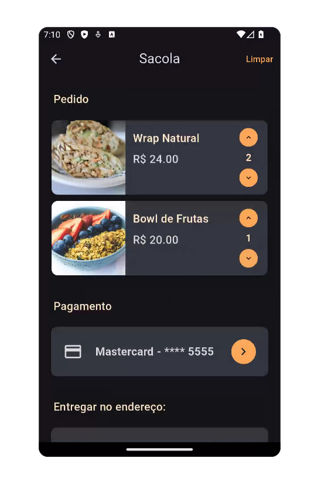

# Pasta `checkout/widgets/`

| BagItemsList, PaymentMethodCard e CleanButton |  AddressCard, OrderSummaryCard e CleanButton  |
|----------------|------------------------|
|  |  |

## `bag_items_list.dart`

### Funcionalidade
O widget `BagItemsList` é responsável por exibir todos os pratos atualmente adicionados à sacola de compras. Para cada item, é exibido:
- A imagem do prato;
- O nome e o preço individual;
- Um controle de quantidade com botões de incremento e decremento;
- Se a sacola estiver vazia, o widget mostra uma mensagem padrão.

---
### Decisão Técnica
- **Gerenciamento de estado com `Provider`**: O widget consome o estado da sacola via `BagProvider`, o que permite acessar a lista de pratos e suas quantidades de forma eficiente e reativa.
- **Layout com `Card` e `Row`**: O uso de `Card` para cada item proporciona um visual destacado e organizado. `Row` estrutura os elementos horizontalmente: imagem, informações do prato e controles.
- **Customização visual**: São utilizados estilos centralizados (`AppTextStyles`, `AppColors`) para garantir consistência visual com o restante do app.

---
### Código comentado

```dart
// Widget que exibe a lista de pratos adicionados à sacola de compras
class BagItemsList extends StatelessWidget {
  const BagItemsList({super.key});

  @override
  Widget build(BuildContext context) {
    // Acesso ao estado da sacola via Provider
    final bagProvider = Provider.of<BagProvider>(context);
    final items = bagProvider.items.entries.toList();

    // Verifica se a sacola está vazia
    if (items.isEmpty) {
      return const Text('Sua sacola está vazia');
    }

    // Lista de cards representando os itens da sacola
    return Column(
      children: items.map((entry) {
        final dish = entry.key;
        final quantity = entry.value;

        return ConstrainedBox(
          constraints: const BoxConstraints(minHeight: 120),
          child: Card(
            color: AppColors.backgroundCardTextColor,
            shape: RoundedRectangleBorder(
              borderRadius: BorderRadius.circular(10),
            ),
            margin: const EdgeInsets.symmetric(vertical: 5, horizontal: 5),
            elevation: 1,
            child: Row(
              crossAxisAlignment: CrossAxisAlignment.start,
              children: [
                // Imagem do prato
                ClipRRect(
                  borderRadius: const BorderRadius.only(
                    topLeft: Radius.circular(10),
                    bottomLeft: Radius.circular(10),
                  ),
                  child: Image.asset(
                    'assets/${dish.imagePath}',
                    width: 120,
                    height: 120,
                    fit: BoxFit.cover,
                  ),
                ),
                const SizedBox(width: 12),

                // Nome e preço do prato
                Expanded(
                  child: Padding(
                    padding: const EdgeInsets.symmetric(vertical: 16),
                    child: Column(
                      crossAxisAlignment: CrossAxisAlignment.start,
                      mainAxisAlignment: MainAxisAlignment.spaceBetween,
                      children: [
                        Text(
                          dish.name,
                          style: AppTextStyles.dishTitle.copyWith(
                            fontSize: 18,
                            fontWeight: FontWeight.w600,
                          ),
                          maxLines: 2,
                          overflow: TextOverflow.ellipsis,
                        ),
                        const SizedBox(height: 8),
                        Text(
                          'R\$ ${dish.price.toStringAsFixed(2)}',
                          style: AppTextStyles.dishPrice.copyWith(
                            fontSize: 18,
                            color: AppColors.cardTextColor,
                            fontWeight: FontWeight.w500,
                          ),
                        ),
                      ],
                    ),
                  ),
                ),

                // Controle de quantidade
                Padding(
                  padding: const EdgeInsets.only(right: 16),
                  child: SizedBox(
                    height: 120,
                    child: Center(
                      child: Column(
                        mainAxisSize: MainAxisSize.min,
                        children: [
                          // Botão para aumentar a quantidade
                          GestureDetector(
                            onTap: () => bagProvider.incrementDish(dish),
                            child: CircleAvatar(
                              radius: 15,
                              backgroundColor: AppColors.mainColor,
                              child: const Icon(
                                Icons.keyboard_arrow_up,
                                color: Colors.black,
                                size: 15,
                              ),
                            ),
                          ),
                          const SizedBox(height: 6),

                          // Quantidade atual do prato
                          Text(
                            '$quantity',
                            style: AppTextStyles.body.copyWith(
                              fontWeight: FontWeight.bold,
                              color: AppColors.highlightTextColor,
                            ),
                          ),
                          const SizedBox(height: 6),

                          // Botão para diminuir a quantidade
                          GestureDetector(
                            onTap: () => bagProvider.decrementDish(dish),
                            child: CircleAvatar(
                              radius: 15,
                              backgroundColor: AppColors.mainColor,
                              child: const Icon(
                                Icons.keyboard_arrow_down,
                                color: Colors.black,
                                size: 15,
                              ),
                            ),
                          ),
                        ],
                      ),
                    ),
                  ),
                ),
              ],
            ),
          ),
        );
      }).toList(),
    );
  }
}
```
---
## `clean_button_bag.dart`

### Funcionalidade
O widget `CleanButton` representa um botão de ação com o rótulo “Limpar”, utilizado para remover todos os itens da sacola de compras de forma rápida.
Ele deve ser posicionado em local de fácil acesso na tela de checkout ou de visualização da sacola.

---
### Decisão Técnica
- **Uso de `TextButton`**: Optou-se por um `TextButton` ao invés de `ElevatedButton` ou `OutlinedButton` por se tratar de uma ação secundária que não precisa de grande destaque visual.
- **Customização de cores via `WidgetStateProperty`**: A cor do texto muda quando o botão é pressionado, utilizando o padrão da paleta do app (`AppColors.buttonsColor` para o estado normal e `AppColors.pressedColor` para o estado pressionado).
- **Callback externo**: O botão é reutilizável e recebe como parâmetro uma função `onPressed`, tornando-o flexível para diferentes contextos onde ações de limpeza possam ser necessárias.

- ---
### Código comentado

```dart
// Botão reutilizável com o rótulo "Limpar", usado para limpar a sacola 
class CleanButton extends StatelessWidget {
  // Função a ser executada ao pressionar o botão
  final VoidCallback onPressed;

  const CleanButton({super.key, required this.onPressed});

  @override
  Widget build(BuildContext context) {
    return TextButton(
      onPressed: onPressed, // Executa a função passada ao pressionar o botão
      style: ButtonStyle(
        // Define a cor do texto dependendo do estado do botão
        foregroundColor: WidgetStateProperty.resolveWith<Color>((states) {
          if (states.contains(WidgetState.pressed)) {
            return AppColors.pressedColor; // Cor ao pressionar
          }
          return AppColors.buttonsColor; // Cor padrão
        }),
      ),
      child: const Text("Limpar"), // Rótulo do botão
    );
  }
}
```
---
## `payment_method_card.dart`

### Funcionalidade
O widget `PaymentMethodCard` exibe a forma de pagamento atualmente selecionada pelo usuário e permite a navegação para uma tela de seleção ou cadastro de métodos. Seu conteúdo varia dinamicamente com base nas escolhas feitas pelo usuário, como cartão de crédito, Pix ou dinheiro.

---
### Decisão Técnica
- **Uso de `UserDataProvider`**: O widget consome informações reativas sobre a forma de pagamento selecionada, utilizando `Provider` para refletir atualizações em tempo real.
- **Design interativo com `InkWell`**: A superfície do `Card` é tornada interativa com o uso de `InkWell`, permitindo efeitos visuais de toque e melhor experiência do usuário.
- **Funções privadas auxiliares (`_getLabel` e `_getIcon`)**: Centralizam a lógica de apresentação textual e icônica, melhorando a legibilidade e manutenção do código.
- **Personalização visual**: Adota cores e estilos definidos pela identidade visual do app, garantindo consistência na interface.

---
### Código comentado

```dart
// Widget que exibe a forma de pagamento atual e permite alterá-la ao ser pressionado
class PaymentMethodCard extends StatelessWidget {
  // Ação a ser executada ao tocar no card (navegar para tela de seleção)
  final VoidCallback onTap;

  const PaymentMethodCard({super.key, required this.onTap});

  // Retorna um texto descritivo baseado no tipo de pagamento e cartão selecionado
  String _getLabel(PaymentMethodType? method, CreditCard? selectedCard) {
    switch (method) {
      case PaymentMethodType.card:
        if (selectedCard != null) {
          return '${selectedCard.brand} - **** ${selectedCard.last4Digits}';
        } else {
          return 'Adicionar forma de pagamento';
        }
      case PaymentMethodType.pix:
        return 'Pix';
      case PaymentMethodType.cash:
        return 'Dinheiro';
      default:
        return 'Escolher método de pagamento';
    }
  }

  // Retorna um ícone correspondente ao tipo de pagamento
  IconData _getIcon(PaymentMethodType? method) {
    switch (method) {
      case PaymentMethodType.card:
        return Icons.credit_card;
      case PaymentMethodType.pix:
        return Icons.pix;
      case PaymentMethodType.cash:
        return Icons.money;
      default:
        return Icons.payment;
    }
  }

  @override
  Widget build(BuildContext context) {
    // Acesso ao provedor com as informações do usuário
    final userProvider = context.watch<UserDataProvider>();
    final selectedMethod = userProvider.selectedPaymentMethod;
    final selectedCard = userProvider.selectedCard;

    return Card(
      color: AppColors.backgroundCardTextColor,
      shape: RoundedRectangleBorder(borderRadius: BorderRadius.circular(10)),
      child: InkWell(
        onTap: onTap, // Executa o callback ao tocar no card
        borderRadius: BorderRadius.circular(10),
        child: Padding(
          padding: const EdgeInsets.all(20.0),
          child: Row(
            children: [
              // Ícone representando o método de pagamento
              Icon(
                _getIcon(selectedMethod),
                color: AppColors.cardTextColor,
                size: 32,
              ),
              const SizedBox(width: 20),

              // Nome do método ou cartão
              Expanded(
                child: Text(
                  _getLabel(selectedMethod, selectedCard),
                  style: const TextStyle(
                    color: AppColors.cardTextColor,
                    fontSize: 18,
                    fontWeight: FontWeight.bold,
                  ),
                ),
              ),

              // Ícone de navegação (seta à direita)
              const CircleAvatar(
                backgroundColor: AppColors.mainColor,
                child: Icon(
                  Icons.chevron_right,
                  color: AppColors.backgroundColor,
                ),
              ),
            ],
          ),
        ),
      ),
    );
  }
}
```
---
## `address_card.dart`

### Funcionalidade
O widget `AddressCard` exibe o endereço de entrega selecionado pelo usuário no processo de finalização da compra. Caso nenhum endereço esteja cadastrado, o cartão convida o usuário a selecionar um. Ele também é interativo, permitindo que o usuário cadastre um endereço ao tocar no componente.

---
### Decisão Técnica
- **Validação de endereço vazio**: A getter `isAddressEmpty` centraliza a lógica para identificar se os dados de endereço estão preenchidos, simplificando a legibilidade do `build`.
- **Renderização condicional**: O conteúdo do cartão muda com base na existência ou não de um endereço, adaptando-se dinamicamente.
- **Estilização consistente**: Usa as cores e estilos definidos na identidade visual da aplicação (`AppColors`), mantendo a coerência com os demais cards da interface.
- **Interatividade com `InkWell`**: Permite resposta visual ao toque, facilitando a navegação para cadastro ou seleção de endereço.

---
### Código comentado

```dart
// Widget que exibe o endereço selecionado para entrega(ou notifica usuário para cadastrar um)
class AddressCard extends StatelessWidget {
  // Função executada ao tocar no card (abrir tela de endereços cadastrados)
  final VoidCallback onTap;

  // Dados do endereço a ser exibido
  final Address address;

  const AddressCard({super.key, required this.onTap, required this.address});

  /// Verifica se o endereço está vazio (sem rua e número)
  bool get isAddressEmpty {
    return address.street.isEmpty && address.number.isEmpty;
  }

  @override
  Widget build(BuildContext context) {
    return Card(
      color: AppColors.backgroundCardTextColor,
      shape: RoundedRectangleBorder(borderRadius: BorderRadius.circular(10)),
      child: InkWell(
        onTap: onTap,
        borderRadius: BorderRadius.circular(10),
        child: Padding(
          padding: const EdgeInsets.all(20.0),
          child: Row(
            children: [
              // Ícone de localização
              const Icon(
                Icons.location_on,
                color: AppColors.cardTextColor,
                size: 32,
              ),
              const SizedBox(width: 16),

              // Conteúdo do endereço ou mensagem de seleção
              Expanded(
                child: isAddressEmpty
                    ? Text(
                        'Selecionar endereço',
                        style: const TextStyle(
                          color: AppColors.cardTextColor,
                          fontSize: 18,
                          fontWeight: FontWeight.bold,
                        ),
                      )
                    : Column(
                        crossAxisAlignment: CrossAxisAlignment.start,
                        children: [
                          // Rua e número
                          Text(
                            '${address.street}, ${address.number}',
                            style: const TextStyle(
                              color: AppColors.cardTextColor,
                              fontSize: 18,
                              fontWeight: FontWeight.bold,
                            ),
                          ),
                          const SizedBox(height: 4),

                          // Bairro, cidade e estado
                          Text(
                            '${address.neighborhood}, ${address.city} - ${address.state}',
                            style: const TextStyle(
                              color: AppColors.cardTextColor,
                              fontSize: 16,
                            ),
                          ),

                          // Complemento, se existir
                          if (address.description.isNotEmpty)
                            Text(
                              address.description,
                              style: const TextStyle(
                                color: AppColors.cardTextColor,
                                fontSize: 14,
                                fontStyle: FontStyle.italic,
                              ),
                            ),
                        ],
                      ),
              ),

              // Ícone de seta para indicar interatividade
              const CircleAvatar(
                backgroundColor: AppColors.mainColor,
                child: Icon(
                  Icons.chevron_right,
                  color: AppColors.backgroundColor,
                ),
              ),
            ],
          ),
        ),
      ),
    );
  }
}
```
---
## `order_summary_card.dart`

### Funcionalidade
O widget `OrderSummaryCard` exibe um resumo financeiro do pedido na tela de checkout. Ele mostra:
- O valor do pedido (subtotal)
- A taxa de entrega
- O valor total
- Informações adicionais de pagamento em dinheiro, caso informadas
- Um botão de confirmação do pedido

Esse componente é essencial para que o usuário revise os valores antes de concluir a compra.

---
### Decisão Técnica
- Utiliza o `Card` com `RoundedRectangleBorder` para manter a identidade visual consistente com outros cards da UI.
- O botão usa `ElevatedButton.icon` com ícone da `FontAwesome` para destacar a ação de finalizar o pedido.
- Foi adicionado um `if` para condicionalmente mostrar informações de pagamento em dinheiro (evitando layout desnecessário).
- Todos os textos seguem as diretrizes de estilo do projeto, com cores e tamanhos definidos em `AppColors` e `AppTextStyles`.
- Os valores são apresentados com 2 casas decimais (t`oStringAsFixed(2)`), garantindo clareza no valor exibido ao usuário.


---
### Código comentado

```dart
// Mostra os valores do pedido resumidos
class OrderSummaryCard extends StatelessWidget {
  // Valores financeiros do pedido
  final double subtotal;
  final double deliveryFee;
  final double total;

  // Callback acionado ao confirmar o pedido
  final VoidCallback onOrder;

  // Valor em dinheiro que o cliente usará para pagar (opcional)
  final double? cashChangeValue;

  const OrderSummaryCard({
    super.key,
    required this.subtotal,
    required this.deliveryFee,
    required this.total,
    required this.onOrder,
    this.cashChangeValue,
  });

  @override
  Widget build(BuildContext context) {
    return Card(
      // Card com visual padronizado
      color: AppColors.backgroundCardTextColor,
      shape: RoundedRectangleBorder(borderRadius: BorderRadius.circular(10)),
      child: Padding(
        padding: const EdgeInsets.all(20.0),
        child: Column(
          crossAxisAlignment: CrossAxisAlignment.stretch,
          children: [

            // Linha: valor do pedido
            Row(
              mainAxisAlignment: MainAxisAlignment.spaceBetween,
              children: [
                const Text('Pedido:',
                  style: TextStyle(
                    color: AppColors.cardTextColor,
                    fontSize: 16,
                    fontWeight: FontWeight.bold,
                  ),
                ),
                Text(
                  'R\$ ${subtotal.toStringAsFixed(2)}',
                  style: const TextStyle(
                    color: AppColors.cardTextColor,
                    fontSize: 16,
                    fontWeight: FontWeight.bold,
                  ),
                ),
              ],
            ),

            const SizedBox(height: 8),

            // Linha: taxa de entrega
            Row(
              mainAxisAlignment: MainAxisAlignment.spaceBetween,
              children: [
                const Text('Entrega:',
                  style: TextStyle(
                    color: AppColors.cardTextColor,
                    fontSize: 16,
                    fontWeight: FontWeight.bold,
                  ),
                ),
                Text(
                  'R\$ ${deliveryFee.toStringAsFixed(2)}',
                  style: const TextStyle(
                    color: AppColors.cardTextColor,
                    fontSize: 16,
                    fontWeight: FontWeight.bold,
                  ),
                ),
              ],
            ),

            const Divider(color: AppColors.mainColor),

            // Linha: total do pedido
            Row(
              mainAxisAlignment: MainAxisAlignment.spaceBetween,
              children: [
                const Text('Total:',
                  style: TextStyle(
                    color: AppColors.mainColor,
                    fontSize: 20,
                    fontWeight: FontWeight.bold,
                  ),
                ),
                Text(
                  'R\$ ${total.toStringAsFixed(2)}',
                  style: const TextStyle(
                    color: AppColors.mainColor,
                    fontSize: 20,
                    fontWeight: FontWeight.bold,
                  ),
                ),
              ],
            ),

            // Se o cliente selecionou pagamento em dinheiro:
            if (cashChangeValue != null && cashChangeValue! > 0) ...[
              const Divider(color: AppColors.mainColor),

              // Valor em dinheiro que será pago
              Row(
                mainAxisAlignment: MainAxisAlignment.spaceBetween,
                children: [
                  const Text('Pagamento em dinheiro:',
                    style: TextStyle(
                      color: AppColors.highlightTextColor,
                      fontSize: 16,
                      fontWeight: FontWeight.bold,
                    ),
                  ),
                  Text(
                    'R\$ ${cashChangeValue!.toStringAsFixed(2)}',
                    style: const TextStyle(
                      color: AppColors.highlightTextColor,
                      fontSize: 16,
                      fontWeight: FontWeight.bold,
                    ),
                  ),
                ],
              ),

              const SizedBox(height: 4),

              // Troco que o entregador precisa devolver
              Row(
                mainAxisAlignment: MainAxisAlignment.spaceBetween,
                children: [
                  const Text('Troco a receber:',
                    style: TextStyle(
                      color: AppColors.cardTextColor,
                      fontSize: 16,
                      fontWeight: FontWeight.bold,
                    ),
                  ),
                  Text(
                    'R\$ ${(cashChangeValue! - total).toStringAsFixed(2)}',
                    style: const TextStyle(
                      color: AppColors.cardTextColor,
                      fontSize: 16,
                      fontWeight: FontWeight.bold,
                    ),
                  ),
                ],
              ),
            ],

            const SizedBox(height: 24),

            // Botão de finalização do pedido
            SizedBox(
              width: double.infinity,
              child: ElevatedButton.icon(
                style: ElevatedButton.styleFrom(
                  backgroundColor: AppColors.mainColor,
                  padding: const EdgeInsets.symmetric(vertical: 16),
                  shape: RoundedRectangleBorder(
                    borderRadius: BorderRadius.circular(32),
                  ),
                ),
                onPressed: onOrder,
                icon: const FaIcon(FontAwesomeIcons.wallet),
                label: Text('Pedir', style: AppTextStyles.button),
              ),
            ),
          ],
        ),
      ),
    );
  }
}
